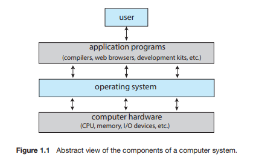

# Chapter01 Introduction

# 서론

>운영체제(OS;Operating system) : 
	컴퓨터 하드웨어를 관리하는 소프트웨어
	응용 프로그램을 위한 기반을 제공
	컴퓨터 사용자와 하드웨어 사이의 중재자 역할

>OS의 근본적인 책임 :
	CPU, 메모리 및 입출력 장치와 저장장치와 같은 자원들을 프로그램에 할당하는 것

이 장의 목표 :
	1. 컴퓨터 시스템의 일반적인 구성과 인터럽트의 역할
	2. 현대 다중 처리기 컴퓨터 시스템의 구성요소
	3. 사용자 모드에서 커널 모드로의 전환
	4. 다양한 컴퓨팅 환경에서 운영체제가 어떻게 사용되는지
	5. 무료 및 고개 소스 운영체제의 예

## 1. 운영체제가 할 일

### 1.1 운영체제가 할 일

>다른 프로그램이 유용한 작업을 할 수 있는 환경을 제공

#### 1.1.1 사용자 관점

