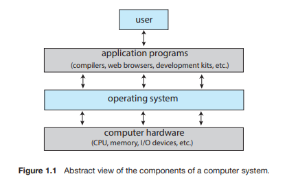
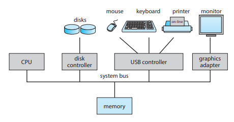
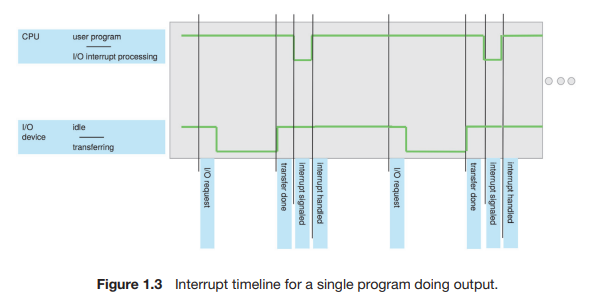
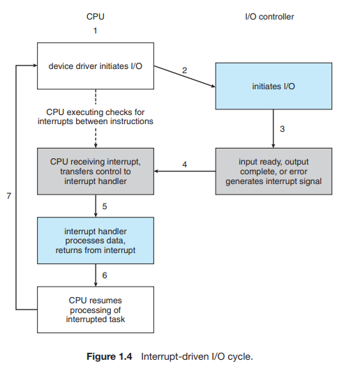
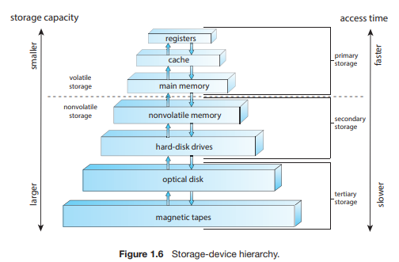
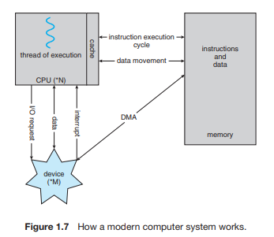
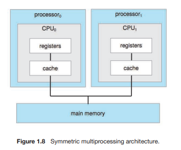
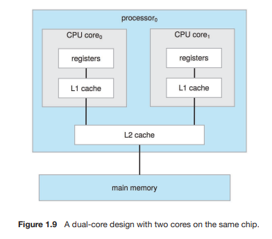

# Chapter01 Introduction

# 서론

- 운영체제(OS;Operating system) :  

>컴퓨터 하드웨어를 관리하는 소프트웨어 
	응용 프로그램을 위한 기반을 제공 
    컴퓨터 사용자와 하드웨어 사이의 중재자 역할 

- OS의 근본적인 책임 :  
> 메모리 및 입출력 장치와 저장장치와 같은 자원들을 프로그램에 할당하는 것 

- 이 장의 목표 :
	1. 컴퓨터 시스템의 일반적인 구성과 인터럽트의 역할
	2. 현대 다중 처리기 컴퓨터 시스템의 구성요소
	3. 사용자 모드에서 커널 모드로의 전환
	4. 다양한 컴퓨팅 환경에서 운영체제가 어떻게 사용되는지
	5. 무료 및 고개 소스 운영체제의 예

---

# 1. 운영체제가 할 일

## 1.1 운영체제가 할 일

>다른 프로그램이 유용한 작업을 할 수 있는 환경을 제공 
>두 가지의 관점에서 운영체제의 역할 

### 1.1.1 사용자 관점

>컴퓨터에 대한 사용자의 관점은 사용되는 인터페이스에 따라 달라진다. 
>많은 컴퓨터 사용자는 PC 앞에서 작업하고 이런 시스템은 한 사용자가 자원을 독점하도록 설계되었으며 목표는 사용자가 수행하는 작업을 최대화하는 것이다. 
>이런 경우 운영체제는 대부분 **사용의 용이성**을 위해 설계되고 성능에 약간 신경을 쓰고 다양한 하드웨어와 소프트웨어 자원이 어떻게 공유되느냐의 **자원의 이용**에는 전혀 신경쓰지 않는다. 

### 1.1.2 시스템 관점

>컴퓨터의 관점에서 운영체제는 하드웨어와 가장 밀접하게 연관된 프로그램이다. 
>운영체제는 **자원할당자(resource allocator)**로 볼 수 있다. 
>CPU 시간, 메모리 공간, 저장장치 공간, 입출력장치 등과 같은 **자원의 관리자**로 동작한다. 

### 1.1.3 운영체제의 정의

>운영체제는 어떤 목적으로 시스템이 존재하느냐에 따라 역할과 기능이 달라진다. 
>운영체제에는 항상 실행 중인 커널, 응용 프로그램 개발을 쉽게 하고 기능을 제공하는 미들웨어 프레임워크 및 시스템 실행 중에 시스템을 관리하는 데 도움이 되는 시스템 프로그램이 포함된다. 

## 1.2 컴퓨터 시스템의 구성

>현대의 범용 컴퓨터 시스템은 여러 CPU와 장치 컨트롤러로 구성되며, 여러 장치 컨트롤러는 공통 버스로 연결된다. 
    장치 컨트롤러는 일부 로컬 버퍼 저장소와 특수 목적 레지스터 집합을 유지 관리한다. 
    장치 컨트롤러는 제어하는 주변 장치와 로컬 버퍼 저장소 간에 데이터를 이동한다. 
>일반적으로 운영체제에는 각 장치 컨트롤러마다 장치 드라이버가 있으며, 장치 드라이버는 장치에 대한 일관된 인터페이스를 운영체제에 제공한다. 

### 1.2.1 인터럽트

- 일반적인 컴퓨터 작업(입출력 수행 프로그램)

1. 장치 드라이버는 장치 컨트롤러의 적절한 레지스터에 값을 적재
2. 장치 컨트롤러는 이 레지스터의 내용을 검사하여 수행할 작업을 결정
3. 컨트롤러는 장치에서 로컬 버퍼로 데이터 전송을 시작
4. 데이터 전송 완료
5. 장치 컨트롤러는 장치 드라이버에게 작업이 완료되었음을 알림 
6. (읽기 요청일 때) 장치 드라이버는 데이터 또는 데이터에 대한 포인터를 반환하며 운영체제의 다른 부분에 제어를 넘김. 
(쓰기 요청일 때) 장치 드라이버는 '쓰기 완료' 또는 '장치 사용 중'과 같은 상태 정보를 반환. 

> 이 과정에서 컨트롤러는 장치 드라이버에게 작업을 완료했다는 사실을 **인터럽트**를 통해 알린다.

#### 1.2.1.1 개요

> 인터럽트는 운영체제와 하드웨어 사이의 상호 작용 방식의 핵심이다. 
> 하드웨어가 CPU에 인터럽트를 발생 시키면 CPU는 인터럽트를 처리하고 다시 하던 일을 한다.

> 인터럽트는 매우 빈번히 발생해서 매우 빨리 처리되어야 한다. 
> 그래서 인터럽트 서비스 루틴의 주소를 제공하는 **인터럽트 벡터**가 있다. 

#### 1.2.1.2 구현

> 기본 인터럽트 메커니즘은 다음과 같다.

1. CPU가 하나의 명령을 완료할 때마다 **인터럽트 요청 라인**을 감지한다.
2. (만약 컨트롤러가 CPU에 인터럽트 요청을 했다면)CPU가 감지한다.
3. 인터럽트 번호를 읽는다.
4. 이 번호를 **인터럽트 벡터**의 인덱스로 사용하여 **인터럽트 핸들러 루틴**으로 점프한다.
5. 해당 인덱스의 주소에서 실행을 시작한다.
6. 인터럽트 처리기는 작업 중 변경될 상태를 저장, 인터럽트 원인 확인, 필요한 처리를 수행하고 상태를 복원하며,*return_from_interrupt* 명령어를 실행한다.
7. CPU를 인터럽트 전으로 되돌린다.

> 위의 과정을 정리하면 다음과 같다.

1. 인터럽트 발생(raise) : 장치 컨트롤러가 인터럽트 요청 라인에 신호를 선언
2. CPU는 인터럽트를 포착(catch)하여 인터럽트 핸들러로 디스패치(dispatch)
3. 핸들러는 장치를 서비스하여 인터럽트를 지운다(clear).

> 최신 운영체제는 더욱 정교한 인터럽트 처리 기능이 필요하다. 
> 다음의 세 가지 기능은  최신 컴퓨터 하드웨어에서 CPU 및 인터럽트 컨트롤러 하드웨어에 의해 제공된다.
> 

- 중요한 처리 중에 인터럽트 처리를 연기할 수 있어야 한다.
- 장치의 적절한 인터럽트 핸들러로 효율적으로 디스패치 할 방법이 필요하다.
- 운영체제가 우선순위가 높은 인터럽트와 우선순위가 낮은 인터럽트를 구분하고 적절한 긴급도로 대응할 수 있도록 다단계 인터럽트가 필요하다.

> 대부분의 CPU에는 2개의 인터럽트 요청 라인이 있다. 

- 마스크 불가능 인터럽트(nonmaskable interrupt) : 복구할 수 없는 메모리 오류와 같은 이벤트를 위해 예약된 인터럽트 라인
- 마스킹 가능(maskable) : 장치 컨트롤러가 서비스를 요청하기 위해 사용된다.

> 벡터 방식 인터럽트 기법의 목적은 모든 인터럽트 소스를 검색하지 않고 주소를 찾기 위함이다. 
> 하지만 실제 컴퓨터에는 인터럽트 벡터의 주소 개수보다 많은 장치가 있다. 
> 이 문제를 해결하는 일반적인 방법은 **인터럽트 체인**을 사용하는 것이다.

> 인터럽트 벡터의 각 원소는 인터럽트 핸들러 리스트의 헤드를 가리키고, 
> 인터럽트가 발생하면 요청을 처리할 수 있는 핸들러가 발견될 때까지 상응하는 리스트의 핸들러가 하나씩 호출된다. 

> 인터럽트는 **우선순위 레벨**이 존재한다. 
> 레벨을 통해 CPU는 모든 인터럽트를 마스킹하지 않고도 우선순위가 낮은 인터럽트 처리를 연기할 수 있고 
> 우선순위가 높은 인터럽트가 우선순위가 낮은 인터럽트의 실행을 선점할 수 있다.

### 1.2.2 저장장치 구조

> 컴퓨터는 프로그램 대부분을 메인 메모리(random-access memory, RAM)이라는 재기록 가능한 메모리에서 가져온다. 
> 메인 메모리는 DRAM(dynamic random-access memory)라 불리는 반도체 기술로 구현된다.

> 프로그램과 데이터를 메인 메모리에 영구히 존재하면 좋을 것 같은데, 두 가지 이유로 불가하다.
> 1. 필요한 프로그램과 데이터를 영구히 저장하기엔 너무 작다는 것
> 2. 휘발성이라는 것 
>
> 그래서 대부분의 컴퓨터 시스템은 **보조저장장치**를 사용한다. 
> 가장 일반적인 보조저장장치는 **하드디스크 드라이브(HDD)**와 **비휘발성 메모리(NVM)**이다. 
> 다른 장치에 저장된 자료의 백업 사본을 저장하기 위해 특수 목적으로만 사용하는 **3차 저장장치**도 있다.   
> 다양한 저장장치 시스템은 저장 용량 및 액세스 시간에 따라 계층 구조로 구성될 수 있다.

### 1.2.3 입출력 구조

> 운영체제 코드의 상당 부분은 **시스템의 안정성과 성능**에 대한 중요성과 장치의 다양한 특성으로 인해 **I/O관리**에 할애된다. 

> 직접 메모리 액세스(DMA)는 인터럽트 구동 I/O의 형태가 대량의 데이터 이동에서 높은 오버헤드를 유발할 수 있다는 문제를 해결하기 위해 사용된다. 
> DMA는 CPU의 개입없이 데이터 블록 전체를 전송하며, 블록 전송이 완료될 때마다 인터럽트가 발생한다.

## 1.3 컴퓨터 시스템 구조

> 컴퓨터 시스템은 사용된 범용 처리기의 수에 따라 분류 가능한 다양한 방식으로 구성될 수 있다.

### 1.3.1 단일 처리기 시스템

>  : 단일 처리 코어를 가진 하나의 CPU를 포함하는 단일 프로세서  
> 코어 : 명령을 실행하고 로컬로 데이터를 저장하기 위한 레지스터를 포함하는 구성요소  
> 운영체제는 이 처리기들이 수행할 다음 태스크에 대한 정보를 보내고 처리기들의 상태를 감시한다. 

### 1.3.2 다중 처리기 시스템

> 각각 단일 코어 CPU가 있는 두개 이상의 프로세서가 있다. 
> 프로세서는 컴퓨터 버스 및 때때로 클록, 메모리 및 주변 장치를 공유한다.  
> 프로세서 수를 늘리면 더 적은 시간에 더 많은 작업을 수행할 수 있다. 
> 하지만, N프로세서의 속도 향상 비율은 N이 아니다. 
> 여러 프로세서가 하나의 작업에 협력할 때 모든 프로세서가 올바르게 작동하게 유지하는 데 일정한 양의 오버헤드가 발생한다.  

> 가장 일반적인 다중 처리기 시스템은 **SMP(symmetric multiprocessing)**으로 각 피어 CPU 프로세서가 운영체제 기능 및 사용자 프로세스를 포함한 모든 작업을 수행한다. 
> 다음은 각각 자체 CPU를 갖는 두 개의 프로세서가 있는 일반적인 SMP 구조이다.

> 이 모델의 장점은 많은 프로세스를 동시에 실행할 수 있다는 것이다.  
> 그러나 CPU가 독립적이기 때문에 하나는 유휴 상태이고 다른 하나는 과부하가 걸려 비효율적일 수 있다.  
> 프로세서가 특정 자료구조를 공유하는 경우에는 이런 비효율성을 피할 수 있다.

> 칩 내 통신이 칩 간 통신보다 빠르므로 다중코어 시스템은 단일 코어를 갖는 여러 칩보다 효율적이다. 
> 다음은 하나의 칩에 두 개의 코어를 갖는 이중-코어 설계이다.

> N 코어를 갖는 다중 코어 프로세서는 운영체제에 N개의 CPU처럼 보인다. 

> 다중 처리기 시스템에 CPU를 추가하면 컴퓨팅 성능이 향상되는데, 
> 그다지 확장성이 좋지 않고, CPU를 너무 많이 추가하면 시스템 버스에 대한 경합이 병목 현상이 되어 성능이 저하되기 시작한다. 

#### NUMA

> 다른 방법으로 각 CPU에 작고 빠른 로컬 버스를 통해 액세스되는 자체 로컬 메모리를 제공하는 것이다. 
> 모든 CPU가 공유 시스템 연결로 연결되어 모든 CPU가 하나의 주소 공간을 공유하는 이 방법을 NUMA(non-uniform memory access)라고 한다. 
> 장점은 CPU가 로컬 메모리에 액세스할 때 빠를 뿐만 아니라 시스템 상호 연결에 대한 경합도 없다. 
> NUMA 시스템은 더 많은 프로세서가 추가될수록 더 효과적으로 확장할 수 있다.
> NUMA 시스템의 단점은 시스템 상호 연결을 통해 원격 메모리에 액세스해야 할 때 지연 시간이 증가하여 성능 저하가 발생할 수 있다. 
> 이는 신중한 CPU 스케줄링 및 메모리 관리를 통해 최소화가 가능하다.

#### 블레이드 서버

> 다수의 처리기 보드 및 입출력 보드, 네트워킹 보드들이 하나의 chassis 안에 장착되는 형태이다. 
> 블레이드 서버는 독립적으로 부팅될 수 있고 자기 자신의 운영체제를 수행한다.

### 1.3.3 클러스터형 시스템

> 둘 이상의 독자적 시스템 또는 노드들을 연결하여 구성한다. 
> 각 노드는 통상 다중 코어 시스템이다.

> 클러스터링은 통상 높은 가용성을 제공하기 위해 사용된다. 
> 일반적으로 높은 가용성은 시스템에 중복 기능을 추가함으로써 얻어진다. 
> 높은 가용성은 안정성을 향상해 많은 응용 프로그램에서 중요하다. 
> 남아 있는 하드웨어 수준에 비례하여 서비스를 계속 제공하는 기능을 **우아한 성능 저하(graceful degaradation)**이라 한다. 
> 단일 구성요소에 오류가 발생해도 계속 작동가능하므로 **결함허용 시스템** 이라고 한다.

#### 대칭형과 비대칭형 클러스터링

> 비대칭형 클러스터링에서는 다른 컴퓨터들이 응용 프로그램을 실행하는 동안 한 컴퓨터는 긴급대기(hot-standby) 모드 상태를 유지한다. 
> 긴급 대기에 들어간 서버들은 감시하는 작업만 수행한다. 
> 서버가 고장나면 긴급 대기 모드의 호스트가 활성 서버가 된다.

> 대칭형 클러스터링에서는 둘 이상의 호스트들이 응용 프로그램을 실행하고 서로를 감시한다. 
> 가용한 하드웨어를 모두 사용하기 때문에 대칭형 구성이 더 효율적이다.

#### 병렬 클러스터

> 여러 호스트가 공유 저장장치상의 동일한 데이터에 접근할 수 있다. 
> 각 기계는 데이터베이스 내의 모든 데이터에 대한 완전한 접근을 하므로 
> 시스템이 접근간 충돌이 발생하지 않도록 접근 제어와 잠금 기법을 제공해야 한다. 
> 이 기능을 분산 잠금 관리자라 한다.

#### 스토리지 전용 네트워크(storage-area network, SAN)

> SAN에 의해 수 킬로미터 떨어진 클러스터 노드들뿐 아니라 한 클러스터 안에서 수천 개의 노드를 지원한다. 
> SAN은 여러 저장장치에 부착할 수 있다. 

