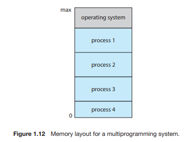
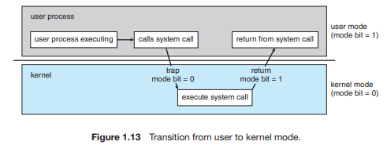
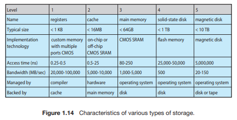
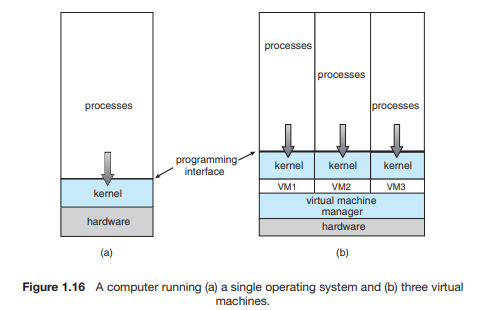

# Chapter01 Introduction

# 서론

- 운영체제(OS;Operating system) :  

>컴퓨터 하드웨어를 관리하는 소프트웨어 
	응용 프로그램을 위한 기반을 제공 
    컴퓨터 사용자와 하드웨어 사이의 중재자 역할 

- OS의 근본적인 책임 :  
> 메모리 및 입출력 장치와 저장장치와 같은 자원들을 프로그램에 할당하는 것 

- 이 장의 목표 :
	1. 컴퓨터 시스템의 일반적인 구성과 인터럽트의 역할
	2. 현대 다중 처리기 컴퓨터 시스템의 구성요소
	3. 사용자 모드에서 커널 모드로의 전환
	4. 다양한 컴퓨팅 환경에서 운영체제가 어떻게 사용되는지
	5. 무료 및 고개 소스 운영체제의 예

---

# 1. 운영체제가 할 일

## 1.1 운영체제가 할 일

>다른 프로그램이 유용한 작업을 할 수 있는 환경을 제공 
>두 가지의 관점에서 운영체제의 역할 

### 1.1.1 사용자 관점

>컴퓨터에 대한 사용자의 관점은 사용되는 인터페이스에 따라 달라진다. 
>많은 컴퓨터 사용자는 PC 앞에서 작업하고 이런 시스템은 한 사용자가 자원을 독점하도록 설계되었으며 목표는 사용자가 수행하는 작업을 최대화하는 것이다. 
>이런 경우 운영체제는 대부분 **사용의 용이성**을 위해 설계되고 성능에 약간 신경을 쓰고 다양한 하드웨어와 소프트웨어 자원이 어떻게 공유되느냐의 **자원의 이용**에는 전혀 신경쓰지 않는다. 

### 1.1.2 시스템 관점

>컴퓨터의 관점에서 운영체제는 하드웨어와 가장 밀접하게 연관된 프로그램이다. 
>운영체제는 **자원할당자(resource allocator)**로 볼 수 있다. 
>CPU 시간, 메모리 공간, 저장장치 공간, 입출력장치 등과 같은 **자원의 관리자**로 동작한다. 

### 1.1.3 운영체제의 정의

>운영체제는 어떤 목적으로 시스템이 존재하느냐에 따라 역할과 기능이 달라진다. 
>운영체제에는 항상 실행 중인 커널, 응용 프로그램 개발을 쉽게 하고 기능을 제공하는 미들웨어 프레임워크 및 시스템 실행 중에 시스템을 관리하는 데 도움이 되는 시스템 프로그램이 포함된다. 

## 1.2 컴퓨터 시스템의 구성

>현대의 범용 컴퓨터 시스템은 여러 CPU와 장치 컨트롤러로 구성되며, 여러 장치 컨트롤러는 공통 버스로 연결된다. 
    장치 컨트롤러는 일부 로컬 버퍼 저장소와 특수 목적 레지스터 집합을 유지 관리한다. 
    장치 컨트롤러는 제어하는 주변 장치와 로컬 버퍼 저장소 간에 데이터를 이동한다. 
>일반적으로 운영체제에는 각 장치 컨트롤러마다 장치 드라이버가 있으며, 장치 드라이버는 장치에 대한 일관된 인터페이스를 운영체제에 제공한다. 

### 1.2.1 인터럽트

- 일반적인 컴퓨터 작업(입출력 수행 프로그램)

1. 장치 드라이버는 장치 컨트롤러의 적절한 레지스터에 값을 적재
2. 장치 컨트롤러는 이 레지스터의 내용을 검사하여 수행할 작업을 결정
3. 컨트롤러는 장치에서 로컬 버퍼로 데이터 전송을 시작
4. 데이터 전송 완료
5. 장치 컨트롤러는 장치 드라이버에게 작업이 완료되었음을 알림 
6. (읽기 요청일 때) 장치 드라이버는 데이터 또는 데이터에 대한 포인터를 반환하며 운영체제의 다른 부분에 제어를 넘김. 
(쓰기 요청일 때) 장치 드라이버는 '쓰기 완료' 또는 '장치 사용 중'과 같은 상태 정보를 반환. 

> 이 과정에서 컨트롤러는 장치 드라이버에게 작업을 완료했다는 사실을 **인터럽트**를 통해 알린다.

#### 1.2.1.1 개요

> 인터럽트는 운영체제와 하드웨어 사이의 상호 작용 방식의 핵심이다. 
> 하드웨어가 CPU에 인터럽트를 발생 시키면 CPU는 인터럽트를 처리하고 다시 하던 일을 한다.

> 인터럽트는 매우 빈번히 발생해서 매우 빨리 처리되어야 한다. 
> 그래서 인터럽트 서비스 루틴의 주소를 제공하는 **인터럽트 벡터**가 있다. 

#### 1.2.1.2 구현

> 기본 인터럽트 메커니즘은 다음과 같다.

1. CPU가 하나의 명령을 완료할 때마다 **인터럽트 요청 라인**을 감지한다.
2. (만약 컨트롤러가 CPU에 인터럽트 요청을 했다면)CPU가 감지한다.
3. 인터럽트 번호를 읽는다.
4. 이 번호를 **인터럽트 벡터**의 인덱스로 사용하여 **인터럽트 핸들러 루틴**으로 점프한다.
5. 해당 인덱스의 주소에서 실행을 시작한다.
6. 인터럽트 처리기는 작업 중 변경될 상태를 저장, 인터럽트 원인 확인, 필요한 처리를 수행하고 상태를 복원하며,*return_from_interrupt* 명령어를 실행한다.
7. CPU를 인터럽트 전으로 되돌린다.

> 위의 과정을 정리하면 다음과 같다.

1. 인터럽트 발생(raise) : 장치 컨트롤러가 인터럽트 요청 라인에 신호를 선언
2. CPU는 인터럽트를 포착(catch)하여 인터럽트 핸들러로 디스패치(dispatch)
3. 핸들러는 장치를 서비스하여 인터럽트를 지운다(clear).

> 최신 운영체제는 더욱 정교한 인터럽트 처리 기능이 필요하다. 
> 다음의 세 가지 기능은  최신 컴퓨터 하드웨어에서 CPU 및 인터럽트 컨트롤러 하드웨어에 의해 제공된다.
> 

- 중요한 처리 중에 인터럽트 처리를 연기할 수 있어야 한다.
- 장치의 적절한 인터럽트 핸들러로 효율적으로 디스패치 할 방법이 필요하다.
- 운영체제가 우선순위가 높은 인터럽트와 우선순위가 낮은 인터럽트를 구분하고 적절한 긴급도로 대응할 수 있도록 다단계 인터럽트가 필요하다.

> 대부분의 CPU에는 2개의 인터럽트 요청 라인이 있다. 

- 마스크 불가능 인터럽트(nonmaskable interrupt) : 복구할 수 없는 메모리 오류와 같은 이벤트를 위해 예약된 인터럽트 라인
- 마스킹 가능(maskable) : 장치 컨트롤러가 서비스를 요청하기 위해 사용된다.

> 벡터 방식 인터럽트 기법의 목적은 모든 인터럽트 소스를 검색하지 않고 주소를 찾기 위함이다. 
> 하지만 실제 컴퓨터에는 인터럽트 벡터의 주소 개수보다 많은 장치가 있다. 
> 이 문제를 해결하는 일반적인 방법은 **인터럽트 체인**을 사용하는 것이다.

> 인터럽트 벡터의 각 원소는 인터럽트 핸들러 리스트의 헤드를 가리키고, 
> 인터럽트가 발생하면 요청을 처리할 수 있는 핸들러가 발견될 때까지 상응하는 리스트의 핸들러가 하나씩 호출된다. 

> 인터럽트는 **우선순위 레벨**이 존재한다. 
> 레벨을 통해 CPU는 모든 인터럽트를 마스킹하지 않고도 우선순위가 낮은 인터럽트 처리를 연기할 수 있고 
> 우선순위가 높은 인터럽트가 우선순위가 낮은 인터럽트의 실행을 선점할 수 있다.

### 1.2.2 저장장치 구조

> 컴퓨터는 프로그램 대부분을 메인 메모리(random-access memory, RAM)이라는 재기록 가능한 메모리에서 가져온다. 
> 메인 메모리는 DRAM(dynamic random-access memory)라 불리는 반도체 기술로 구현된다.

> 프로그램과 데이터를 메인 메모리에 영구히 존재하면 좋을 것 같은데, 두 가지 이유로 불가하다.
> 1. 필요한 프로그램과 데이터를 영구히 저장하기엔 너무 작다는 것
> 2. 휘발성이라는 것 
>
> 그래서 대부분의 컴퓨터 시스템은 **보조저장장치**를 사용한다. 
> 가장 일반적인 보조저장장치는 **하드디스크 드라이브(HDD)**와 **비휘발성 메모리(NVM)**이다. 
> 다른 장치에 저장된 자료의 백업 사본을 저장하기 위해 특수 목적으로만 사용하는 **3차 저장장치**도 있다.   
> 다양한 저장장치 시스템은 저장 용량 및 액세스 시간에 따라 계층 구조로 구성될 수 있다.

### 1.2.3 입출력 구조

> 운영체제 코드의 상당 부분은 **시스템의 안정성과 성능**에 대한 중요성과 장치의 다양한 특성으로 인해 **I/O관리**에 할애된다. 

> 직접 메모리 액세스(DMA)는 인터럽트 구동 I/O의 형태가 대량의 데이터 이동에서 높은 오버헤드를 유발할 수 있다는 문제를 해결하기 위해 사용된다. 
> DMA는 CPU의 개입없이 데이터 블록 전체를 전송하며, 블록 전송이 완료될 때마다 인터럽트가 발생한다.

## 1.3 컴퓨터 시스템 구조

> 컴퓨터 시스템은 사용된 범용 처리기의 수에 따라 분류 가능한 다양한 방식으로 구성될 수 있다.

### 1.3.1 단일 처리기 시스템

>  : 단일 처리 코어를 가진 하나의 CPU를 포함하는 단일 프로세서  
> 코어 : 명령을 실행하고 로컬로 데이터를 저장하기 위한 레지스터를 포함하는 구성요소  
> 운영체제는 이 처리기들이 수행할 다음 태스크에 대한 정보를 보내고 처리기들의 상태를 감시한다. 

### 1.3.2 다중 처리기 시스템

> 각각 단일 코어 CPU가 있는 두개 이상의 프로세서가 있다. 
> 프로세서는 컴퓨터 버스 및 때때로 클록, 메모리 및 주변 장치를 공유한다.  
> 프로세서 수를 늘리면 더 적은 시간에 더 많은 작업을 수행할 수 있다. 
> 하지만, N프로세서의 속도 향상 비율은 N이 아니다. 
> 여러 프로세서가 하나의 작업에 협력할 때 모든 프로세서가 올바르게 작동하게 유지하는 데 일정한 양의 오버헤드가 발생한다.  

> 가장 일반적인 다중 처리기 시스템은 **SMP(symmetric multiprocessing)**으로 각 피어 CPU 프로세서가 운영체제 기능 및 사용자 프로세스를 포함한 모든 작업을 수행한다. 
> 다음은 각각 자체 CPU를 갖는 두 개의 프로세서가 있는 일반적인 SMP 구조이다.

> 이 모델의 장점은 많은 프로세스를 동시에 실행할 수 있다는 것이다.  
> 그러나 CPU가 독립적이기 때문에 하나는 유휴 상태이고 다른 하나는 과부하가 걸려 비효율적일 수 있다.  
> 프로세서가 특정 자료구조를 공유하는 경우에는 이런 비효율성을 피할 수 있다.

> 칩 내 통신이 칩 간 통신보다 빠르므로 다중코어 시스템은 단일 코어를 갖는 여러 칩보다 효율적이다. 
> 다음은 하나의 칩에 두 개의 코어를 갖는 이중-코어 설계이다.

> N 코어를 갖는 다중 코어 프로세서는 운영체제에 N개의 CPU처럼 보인다. 

> 다중 처리기 시스템에 CPU를 추가하면 컴퓨팅 성능이 향상되는데, 
> 그다지 확장성이 좋지 않고, CPU를 너무 많이 추가하면 시스템 버스에 대한 경합이 병목 현상이 되어 성능이 저하되기 시작한다. 

#### NUMA

> 다른 방법으로 각 CPU에 작고 빠른 로컬 버스를 통해 액세스되는 자체 로컬 메모리를 제공하는 것이다. 
> 모든 CPU가 공유 시스템 연결로 연결되어 모든 CPU가 하나의 주소 공간을 공유하는 이 방법을 NUMA(non-uniform memory access)라고 한다. 
> 장점은 CPU가 로컬 메모리에 액세스할 때 빠를 뿐만 아니라 시스템 상호 연결에 대한 경합도 없다. 
> NUMA 시스템은 더 많은 프로세서가 추가될수록 더 효과적으로 확장할 수 있다.
> NUMA 시스템의 단점은 시스템 상호 연결을 통해 원격 메모리에 액세스해야 할 때 지연 시간이 증가하여 성능 저하가 발생할 수 있다. 
> 이는 신중한 CPU 스케줄링 및 메모리 관리를 통해 최소화가 가능하다.

#### 블레이드 서버

> 다수의 처리기 보드 및 입출력 보드, 네트워킹 보드들이 하나의 chassis 안에 장착되는 형태이다. 
> 블레이드 서버는 독립적으로 부팅될 수 있고 자기 자신의 운영체제를 수행한다.

### 1.3.3 클러스터형 시스템

> 둘 이상의 독자적 시스템 또는 노드들을 연결하여 구성한다. 
> 각 노드는 통상 다중 코어 시스템이다.

> 클러스터링은 통상 높은 가용성을 제공하기 위해 사용된다. 
> 일반적으로 높은 가용성은 시스템에 중복 기능을 추가함으로써 얻어진다. 
> 높은 가용성은 안정성을 향상해 많은 응용 프로그램에서 중요하다. 
> 남아 있는 하드웨어 수준에 비례하여 서비스를 계속 제공하는 기능을 **우아한 성능 저하(graceful degaradation)**이라 한다. 
> 단일 구성요소에 오류가 발생해도 계속 작동가능하므로 **결함허용 시스템** 이라고 한다.

#### 대칭형과 비대칭형 클러스터링

> 비대칭형 클러스터링에서는 다른 컴퓨터들이 응용 프로그램을 실행하는 동안 한 컴퓨터는 긴급대기(hot-standby) 모드 상태를 유지한다. 
> 긴급 대기에 들어간 서버들은 감시하는 작업만 수행한다. 
> 서버가 고장나면 긴급 대기 모드의 호스트가 활성 서버가 된다.

> 대칭형 클러스터링에서는 둘 이상의 호스트들이 응용 프로그램을 실행하고 서로를 감시한다. 
> 가용한 하드웨어를 모두 사용하기 때문에 대칭형 구성이 더 효율적이다.

#### 병렬 클러스터

> 여러 호스트가 공유 저장장치상의 동일한 데이터에 접근할 수 있다. 
> 각 기계는 데이터베이스 내의 모든 데이터에 대한 완전한 접근을 하므로 
> 시스템이 접근간 충돌이 발생하지 않도록 접근 제어와 잠금 기법을 제공해야 한다. 
> 이 기능을 분산 잠금 관리자라 한다.

#### 스토리지 전용 네트워크(storage-area network, SAN)

> SAN에 의해 수 킬로미터 떨어진 클러스터 노드들뿐 아니라 한 클러스터 안에서 수천 개의 노드를 지원한다. 
> SAN은 여러 저장장치에 부착할 수 있다. 

## 1.4 운영체제의 작동

> 운영체제는 프로그램이 실행되는 환경을 제공한다. 
> 운영체제는 내부적으로 구성되는 부분이 저마다 큰 차이를 보이는데, 많은 공통점들이 있으니 그에 대해 먼저 정리를 하는 게 우선인 것 같다.  

> 1. 전원이 켜지면 하드웨어에 펌웨어로 저장된 부트스트랩 프로그램이 실행된다.
> 2. 부트스트랩 프로그램은 OS 커널을 찾아서 메모리에 운영체제를 적재하는 방법과 시스템 실행을 하는 방법을 메모리에 적재한다.
> 3. 실행되면 시스템과 사용자에게 서비스를 제공한다.

> **시스템 데몬**이라는 일부 서비스는 커널이 실행되는 전체 시간동안 실행되며, 부팅할 때 메모리에 적재되는 시스템 프로그램에 의해 커널 외부에서 제공된다. 
> 실행할 프로세스나 서비스할 I/O 장치 및 응답할 사용자가 없는 경우 운영체제는 이벤트를 기다린다. 
> 이벤트는 거의 항상 인터럽트를 통해 발생된다. 
> 하드웨어 인터럽트가 있고, 트랩(예외), 오류 또는 사용자의 프로그램 요청에 의해 발생하는 인터럽트가 있다. 
> 사용자의 요청 인터럽트는 **시스템 콜**이라는 특수 연산을 실행하여 요청되고 운영체제가 제공하는 서비스가 수행될 것을 요구한다.

### 1.4.1 다중 프로그래밍과 다중 태스킹

#### 다중 프로그래밍

> CPU가 항상 한 개는 실행할 수 있도록 프로그램을 구성하여 CPU 이용률을 높이고 사용자 만족도를 높인다. 
> 다중 프로그램 시스템에서 실행 중인 프로그램을 **프로세스**라 한다. 
> 운영체제는 여러 프로세스를 동시에 메모리에 유지하며 다음 그림과 같다.

> 프로세스는 순차적으로 완료를 기다려야 할 수 있다. 
> 다중 프로그래밍되지 않았다면 CPU가 유휴 상태일 수 있다. 
> 다중 프로그램 시스템에서 운영체제는 한 프로세스 대기 상태일 때 다른 프로세스로 전환하고, 대기를 마친 프로세스는 CPU는를 다시 돌려받는다. 

#### 다중 태스킹

> 다중 태스킹은 다중 프로그래밍의 논리적 확장이다. 

> 다중 태스킹 시스템에서 CPU는 여러 프로세스를 전환하며 프로세스를 실행하지만 전환이 자주 발생하여 사용자에게 빠른 응답 시간을 제공하게 된다. 
> 이를 위해서는 동시에 여러 프로세스를 메모리에 유지하기 위해 **메모리 관리 방식**도 필요하고, 
> 여러 프로세스가 동시에 실행할 준비가 되면 어떤 프로세스가 실행할 지 결정하는 **CPU스케줄링**도 필요하다. 

> 다중 태스킹 시스템에서 운영체제는 적절한 응답 시간을 보장해야 한다. 
> 적절한 응답 시간을 보장하는 일반적인 방법은 **가상 메모리**이다. 

- 가상 메모리
> 일부만 메모리에 적재된 프로세스의 실행을 허용하는 기법 
> 이 기법의 주요한 이점은 프로그램이 물리 메모리의 크기보다 더 커도 된다는 것이고 
> 사용자에게 보이는 논리 메모리와 물리 메모리를 분리시켜, 프로그래머를 메모리 저장장치의 한계로부터 자유롭게 해준다. 

> 다중 프로그래밍 및 다중 태스킹 시스템도 파일 시스템을 제공해야 한다. 
> 파일 시스템은 보조저장장치에 존재하고, 저장장치 관리가 제공되어야 하고 
> 시스템은 부적절한 사용으로부터 자원을 보호해야 한다. 

### 1.4.2 이중-모드와 다중모드 운용

> 운영체제와 사용자는 컴퓨터 시스템의 하드웨어 및 소프트웨어 자원을 공유하므로 잘못 실행될 수 없도록 보장해야 한다. 
> 올바르게 실행할 수 있도록 **운영체제 코드 실행**과 **사용자 정의 코드 실행**으로 구분한다.
> 적어도 두 개의 독립된 연산 모드인 **사용자 모드**와 **커널 모드**를 필요로 한다. 
> 모드의 구분을 위해 **모드 비트**를 두어, 이 비트가 0일 때는 커널모드, 1일 때는 사용자모드로 나타낸다. 
> 하나의 서비스 요청 시 두 모드가 같이 동작하게 되는데, 다음 그림을 보면 쉽게 이해할 수 있다.

> 동작의 이중모드는 잘못된 사용자로부터 운영체제를, 그리고 잘못된 사용자 서로를 보호한다. 
> 악영향을 끼칠 수 있는 일부 명령을 **특권 명령**으로 지정하여 특권 명령이 커널모드에서만 수행되도록 허용하여 보호한다. 

> 모드의 개념은 두 가지 이상으로 확장될 수 있다. 
> 예를 들어, Intel 프로세서에는 4개의 분리된 보호링이 있다. 
> 링 0은 커널모드, 링 3은 사용자 모드이며 링 1과 2는 다양한 운영체제 서비스에 사용될 수 있지만 실제로는 잘 사용되지 않는다. 

### 1.4.3 타이머

> 운영체제가 CPU에 대한 제어를 유지할 수 있도록 보장해야 한다. 
> 무한루프에 빠지거나 시스템 호출 시 제어가 운영체제로 복귀하지 않는 경우가 없어야 한다. 
> 그러기 위해 **타이머**를 사용할 수 있다. 

- 가변 타이머
> 일반적으로 고정률의 클록과 계수기로 구현한다. 
> 운영체제가 계수기 값을 설정하고 클록이 tick할 때마다 계수기가 감소한다. 
> 계수기가 0이 될 때 인터럽트가 발생하여 타이머를 사용할 수 있다.

## 1.5 자원관리

> 운영체제는 자원 관리자이다. 
> 시스템의 CPU, 메모리 공간, 파일 저장 공간 및 I/O장치는 운영체제가 관리하는 자원이다. 

### 1.5.1 프로세스 관리

> 프로그램은 CPU에 의해 명령이 실행되어 프로세스가 된다. 
> 프로세스는 자신의 일을 수행하기 위해 CPU 시간, 메모리, 파일 그리고 입출력 장치를 포함한 여러 자원을 사용한다. 
> 그리고 프로세스가 종료되면 자원을 운영체제에 반납한다.

> 시스템은 프로세스의 집합이다. 
> 프로세스는 운영체제 프로세스(시스템 코드 수행)와 사용자 프로세스(사용자 코드 수행)로 구분된다. 
> 이런 모든 프로세스들은 병렬로 병행하게 실행할 수 있다. 
> 운영체제는 프로세스 관리와 관련하여 다음과 같은 활동을 해야 한다.

- 사용자 프로세스와 시스템 프로세스의 생성과 제거
- CPU에 프로세스와 스레드 스케줄링
- 프로세스의 일시 중지와 재수행
- 프로세스 동기화를 위한 기법 제공
- 프로세스 통신을 위한 기법 제공

### 1.5.2 메모리 관리

> 메인 메모리는 CPU와 입출력 장치에 의해 공유되는 빠른 접근이 가능한 데이터 저장소이다. 
> 일반적으로 CPU가 직접 주소를 지정할 수 있고 직접 접근할 수 있는 유일한 대량 메모리이다. 
> CPU 이용률과 사용자에 대한 컴퓨터의 응답 속도를 개선하기 위해 메모리에 여러 프로그램을 유지해야 하고, 이를 위해 메모리 관리 기법이 필요하다. 
> 메모리 관리 기법은 여러 접근 방법이 있고, 각 알고리즘의 효율성은 특정 상황에 따라 다르다. 
> 메모리 관리 기법의 선택에는 여러 요인이 있지만, 특히 시스템의 하드웨어 설계에 좌우된다.
> 운영체제는 메모리 관리와 관련하여 다음과 같은 기능을 수행해야 한다.

- 메모리의 어느 부분이 현재 사용되고 있으며 어느 프로세스에 의해 사용되고 있는지를 추적
- 필요에 따라 메모리 공간을 할당하고 회수
- 어떤 프로세스들을 메모리에 적재하고 제거할 것인지 결정

### 1.5.3 파일 시스템 관리

> 운영체제는 저장장치의 물리적 특성을 추상화하여 논리적인 저장 단위인 파일을 정의한다. 
> 파일을 물리적 매체로 매핑하여, 저장장치를 통해 파일들에 접근한다. 

> 파일은 파일 생성자에 의해 정의된 관련 정보의 집합체이다. 
> 일반적으로 파일은 프로그램(소스와 목적 프로그램 형태)과 데이터를 나타낸다. 

> 운영체제는 대량 저장 매체와 그것을 제어하는 장치를 관리함으로써 파일의 추상적인 개념을 구현한다. 
> 운영체네는 파일관리를 위해 다음과 같은 일을 수행한다.

- 파일의 생성 및 제거
- 디렉터리 생성 및 제거
- 파일과 디렉터리를 조작하기 위한 프리미티브 제공
- 파일을 보조저장장치로 매핑
- 안정적인(비휘발성) 저장 매체에 파일 백업

### 1.5.4 대용량 저장장치 관리

> 컴퓨터 시스템은 메인 메모리를 백업하기 위해 보조저장장치를 제공해야 한다. 
> 대부분의 최신 컴퓨터 시스템은 HDD와 NVM 장치를 프로그램과 데이터 모두에 대한 주요 저장매체로 사용한다. 
> 운영체제는 보조저장장치관리를 위해 다음 활동을 담당한다.

- 마운팅, 언마운팅
- 사용 가능 공간의 관리
- 저장장소 할당
- 디스크 스케줄링
- 저장장치 분할
- 보호

### 1.5.5 캐시 관리

> 캐싱은 컴퓨터 시스템의 중요한 원리이다. 
> 저장 장치 중 더 빠른 장치인 캐시에 일시적으로 정보가 복사된다. 
> 어떤 정보가 필요할 경우 우선적으로 캐시를 탐색하고 캐시에 없을 경우에 메인 메모리를 탐색한다. 

> CPU 내부의 프로그램 가능한 레지스터들은 메인 메모리를 위한 고속의 캐시로 볼 수 있다. 
> 프로그래머는 어느 정보를 메인 메모리에 두고, 어느 정보를 레지스터에 둘 것인지 결정해야 하고, 레지스터 할당 정책과 교체 알고리즘을 구현한다.

> 캐시 크기는 제한되어 있으므로 캐시 관리는 중요한 설계 문제이다. 
> 저장장치의 계층 구조에서 각 수준 간의 정보 이동은 하드웨어 설계나 제어하는 운영체제에 따라 명시적 또는 묵시적으로 이뤄진다. 
> 다음은 다양한 유형의 저장장치의 특성을 보여준다.

- 캐시 일관성 문제
> 메모리의 계층 구조에서 동일한 데이터가 서로 다른 수준의 저장장치가 시스템에 나타나게 된다.
> 다중 태스킹 환경에서 여러 프로세스가 어떤 정수 A에 접근하기 원할 때 이들 각 프로세스가 가장 최근에 갱신된 A의 값을 얻는 것을 보장하기 위해 극도의 주의가 필요하다. 
> 여러 CPU가 모두 동시에 실행될 수 있어서 A값이 갱신될 경우에 모든 캐시의 A값에 즉각 반영되어야 한다.
> 이런 상황을 **캐시 일관성 문제**라 한다.

### 1.5.6 입출력 시스템 관리

> 운영체제의 목적 중 하나는 사용자에게 특정 하드웨어 장치의 특성을 숨기는 것이다. 
> 단지 장치 드라이버만이 자신에게 지정된 특정 장치의 특성을 알고 있다.

## 1.6 보안과 보호

> 컴퓨터 시스템이 다수의 사용자를 가지며 여러 프로세스의 병행 수행을 허용한다면 데이터에 대한 접근은 반드시 규제되어야 한다. 
> 이를 위해 운영체제로부터 적절한 허가를 획득한 프로세스만이 작업할 수 있도록 보장하는 기법이 필요하다. 

- 보호
> **보호**란 컴퓨터 시스템이 정의한 자원에 대해 프로그램, 프로세스, 또는 사용자들의 접근을 제어하는 기법이다. 
> 이 기법은 시행될 제어에 대한 명세와 이들을 강제 시행하는 방법을 규정하는 수단을 반드시 제공해야 한다.

- 보안
> 컴퓨터 시스템은 충분한 보호 기능이 있더라도 여전히 고장이 나거나 부적절한 접근을 허용할 수 있다. 
> 사용자의 인증 정보를 도난당했을 경우에 사용자의 데이터는 복사 또는 삭제될 수 있다. 
> 외부 또는 내부의 공격을 방어하는 것은 **보안**이다. 

- 사용자 식별자, 그룹 식별자
> 보호와 보안을 제공하기 위해서는 시스템의 모든 사용자를 구분할 수 있어야 한다. 
> 운영체제는 **사용자 식별자** 리스트를 유지한다. 
> 어떤 상황에서는 사용자가 아닌 사용자 집합을 구분하기 원한다. 
> 때때로 원한을 작업을 위해 권한의 상승이 필요할 때도 있다. 

## 1.7 가상화

> 가상화는 단일 컴퓨터(CPU, 메모리, 디스크 드라이브, 네트워크 인터페이스 카드 등)의 하드웨어를 여러 가지 실행 환경으로 추상화하여 개별 환경이 자신만의 컴퓨터에서 실행되고 있다는 환상을 만들 수 있는 기술이다. 
> 이런 환경은 동시에 실행되고 서로 상호작용할 수 있는 다른 개별 운영체제로 볼 수 있다. 
> 가상화는 운영체제가 다른 운영체제 내에서 하나의 응용처럼 수행될 수 있게 한다. 

> 가상화 소프트웨어는 에뮬레이션을 포함하는 클래스의 구성원이다. 
> 에뮬레이션은 일반적으로 CPU 유형이 다른 경우 사용된다. 
> 이런 개념은 한 기계를 위해 작성된 전체 운영체제를 다른 기계에서 수행되도록 확장될 수 있다. 
> 대신 비용이 크다. 
> 모든 명령이 목표 시스템에서 똑같이 수행되도록 번역되어야 하므로 원래의 코드보다 훨씬 느리다.
> 다음은 하나의 운영체제를 실행시키는 것과 가상머신 3개를 실행시키는 컴퓨터를 비교한 그림이다.

## 1.8 분산 시스템

> 분산시스템은 물리적으로 떨어져 있는 이기종 컴퓨터들의 집합이다. 
> 분산 시스템의 컴퓨터들은 사용자가 시스템 내의 다양한 자원들을 접근할 수 있도록 네트워크로 연결되어 있다. 
> 그래서 분산 시스템의 많은 기능은 네트워크 의존적이다.

- 네트워크
> 네트워크는 가장 단순하게 보면 두 개 이상 시스템 간의 통신 경로이다. 
> 네트워크는 사용되는 프로토콜, 노드 간 거리, 전송 매체에 따라 다르다. 
> **TCP/IP**는 가장 일반적인 네트워크 프로토콜로 인터넷의 기본 구조를 제공한다. 
> 네트워크는 노드 간 거리에 의해 유형이 결정된다. 
 
- LAN(근거리 통신망) : 한 방, 한 층, 또는 한 건물에 존재
- WAN(광역 통신망) : 통산 건물, 도시 또는 국가를 연결
- MAN(도시권 통신망) : 한 도시 내의 건물들을 연결
- PAN(단거리 통신망) : 블루투스와 802.11장치는 무선 통신 기술을 사용하여 수 미터 짧은 거리에서 통신

### 네트워크 운영체제

> 네트워크 운영체제는 다른 컴퓨터의 다른 프로세스가 메시지를 교환할 수 있도록 하는 통신 체계와 함께 네트워크를 통한 파일 공유와 같은 기능을 제공하는 운영체제이다.

## 1.9 커널 자료구조

> 운영체제 구현의 중심. 시스템에서 데이터가 구조화되는 방법! 
> 다수의 자료구조에 대해 알아보자. 
> 단순히 무엇인지 알아보는 것은 제외하고 운영체제와 관련된 부분만 확인하자.

### 1.9.1 리스트, 스택 및 큐

> 메인 메모리는 하나의 배열로 구축된다. 
> 이때 데이터 크기가 변하거나 한 데이터를 제거하고 나머지 데이터를 유지할 경우와 같은 상황에서는 배열 대신 다른 구조를 사용해야 한다. 

> 리스트는 데이터 값들의 집단을 하나의 시퀀스로 표시한다. 
> 리스트는 자주 커널 알고리즘에 의해 직접 사용된다. 

> 스택은 순차적 순서를 가진 자료구조로 항을 넣거나 꺼내는 데 후입선출(LIFO)을 사용한다. 
> 운영체제는 함수를 호출할 경우 종종 스택을 사용한다.

> 큐는 순차 순서의 자료구조로 선입선출(FIFO)을 사용한다. 
> 운영체제에서는 프린터에 보내진 작업이 제출된 순서대로 인쇄는 것과 같이 흔히 사용된다. 
> 또한 CPU에서 수행을 기다리는 태스크들도 종종 큐로 구성된다.

### 1.9.2 트리

> 트리는 데이터의 서열을 표시하는 데 사용한 자료구조이다. 
> 일반트리, 이진트리, 이진탐색트리, 균형이진탐색트리가 있으며 Linux가 CPU 스케줄링 알고리즘의 일부로 균형이진탐색트리를 사용한다. 

### 1.9.3 해시 함수와 맵

> 테이블에서 해시 함수를 사용하여 데이터를 인출할 경우 O(1)만큼 좋을 수도 있다. 
> 이런 성능 덕에 해시 함수는 운영체제에서 광범위하게 사용된다. 
> 해시 함수의 용도는 해시 맵을 구현하는 것이다. 

### 1.9.4 비트맵

> 비트맵은 n개의 항의 상태를 나타내는 데 사용 가능한 n개의 이진 비트의 스트링이다. 
> 대량의 자원 가용성을 표시할 때 일반적으로 사용된다. 
> 디스크 드라이브가 좋은 예이다. 
> 디스크 블록이라는 수천 개의 독립된 단위로 나누어지는데, 디스크 블록의 가용 여부를 나타내기 위해 비트맵을 사용할 수 있다. 

