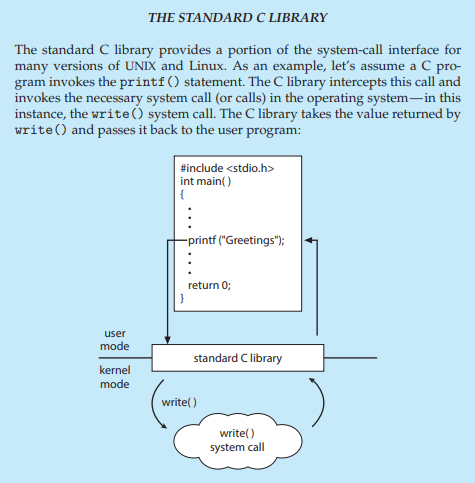
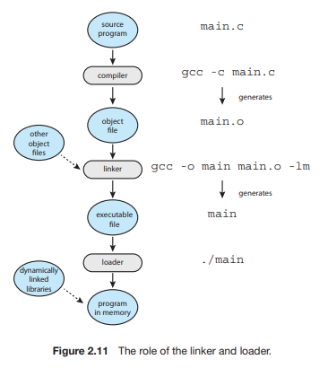
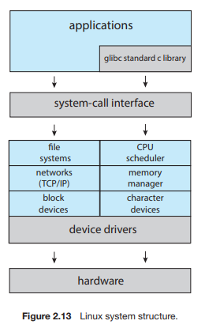
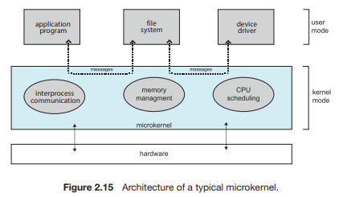
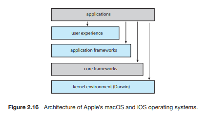
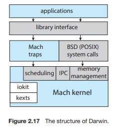
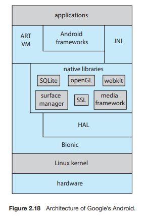

# Chapter02 Operating System Structures

# 운영체제 구조

## 2.1 운영체제 서비스

> 운영체제는 프로그램과 프로그램 사용자에게 특정 서비스를 제공한다. 
> 저마다 다른 서비스를 제공하지만 공통된 부류가 있다. 
> 다음의 서비스들은 프로그래머가 프로그래밍 작업을 더 쉽게 수행할 수 있도록 한다.

- 사용자 인터페이스
- 프로그램 수행
- 입출력 연산
- 파일 시스템 조작
- 통신
- 오류 탐지
- 자원 할당
- 기록 작성
- 보호와 보안

## 2.2 사용자와 운영체제 인터페이스

### 2.2.1 명령 인터프리터

> 운영체제 대부분은 명령 인터프리터를 프로세스가 시작되거나 사용자가 처음 로그온할 때 수행되는 특수한 프로그램으로 취급한다. 
> 선택할 수 있는 여러 명령 인터프리터를 제공하는 시스템엥서 이ㅏ 해석기는 **셸(shell)**이라 한다. 
> 명령 인터프리터의 중요한 기능은 사용자가 지정한 명령을 수행하는 것이다. 

#### 명령어의 두 가지 일반적인 구현 방식

1. 명령 인터프리터 자체가 명령을 실행할 코드를 갖는 경우
> 제공될 수 있는 명령의 수가 명령 인터프리터의 크기를 결정한다.

2. 시스템 프로그램에 의해 대부분의 명령을 구현하는 것
> 명령 인터프리터는 그 명령을 알지 못한다. 
> 단지 메모리에 적재되어 실행될 파일을 식별하기 위해 명령을 사용한다.

### 2.2.2 그래픽 기반 사용자 인터페이스

### 2.2.3 터치스크린 인터페이스

### 2.2.4 인터페이스의 선택

> 어떤 인터페이스를 선택할 지는 개인의 선호에 달려 있다. 

## 2.3 시스템 콜

> **시스템 콜**은 운영체제에 의해 사용 가능하게 된 서비스에 대한 인터페이스를 제공한다. 

### 2.3.1 시스템 콜 예제

> 다음은 시스템 콜이 사용되는 방법의 예이다.

### 2.3.2 응용 프로그래밍 인터페이스

> 대부분의 응용 개발자들은 **응용 프로그래밍 인터페이스(application programming interface, API)**에 따라 프로그램을 설계한다. 
> 예를 들어, Windows 함수 CreateProcess()는 새로운 프로세스를 생성하는 데 사용된다.

-  프로그램의 호환성 :
>   같은 API를 지원하는 어느 시스템에서건 컴파일되고 실행되도록 기대하기 때문이다. 
>   게다가 실제 시스템 콜은 종종 좀 더 자세한 명세가 필요하고 프로그램상에서 작업하기가 응용 프로그래머에게 가용한 API보다 더 어렵다. 

- 실행시간 환경(RTE) :
>   운영체제가 제공하는 시스템 콜에 대한 연결고리 역할을 하는 시스템 콜 인터페이스를 제공한다. 
>   시스템 콜 인터페이스는 API 함수의 호출을 가로채어 필요한 운영체제 시스템 콜을 부른다. 
>   운영체제 인터페잇흐에 대한 대부분의 자세한 내용은 API에 의해 프로그래머로부터 숨겨지고 RTE에 의해 관리된다. 

#### 운영체제에 매개변수를 전달하기 위한 세 가지 일반적인 방법

1. 매개변수를 레지스터 내에 전달하는 방법
2. 매개벼니수를 메모리 내 블록이나 테이블에 저장하고, 블록의 주소가 레지스터 내에 매개변수로 전달되는 방법
3. 매개변수가 5개가 넘을 경우 블록 방법

> 일부 운영체제에서 블록이나 스택방법을 선호하는데, 이유는 전달되는 매개변수들의 개수나 길이에 제한이 없기 때문이다.

### 2.3.3 시스템 콜의 유형

- 프로세스 제어
  - 끝내기, 중지
  - 적재, 수행
  - 프로세스 생성, 종료
  - 프로세스 속성 획득, 설정
  - 시간을 기다림
  - 이벤트를 기다림 및 알림
  - 메모리 할당 및 자유화
- 파일 조작
  - 파일 생성, 삭제
  - 열기, 닫기
  - 읽기, 쓰기, 위치 변경
  - 파일 속성 획득 및 설정
- 장치 관리
  - 장치 요구, 방출
  - 읽기, 쓰기, 위치 변경
  - 장치 속성 획득, 설정
  - 장치의 논리적 부착 또는 분리
- 정보 유지 보수
  - 시간과 날짜의 설정과 획득
  - 시스템 데이터의 설정과 획득
  - 프로세스, 파일, 장치 속성의 획득 및 설정
- 통신
  - 통신 연결의 생성, 제거
  - 메시지의 송신, 수신
  - 상태 정보 전달
  - 원격 장치의 부착 및 분리
- 보호
  - get file permissions
  - set file permissions

#### 2.3.3.1 프로세스 제어

> 1. 실행 중인 프로그램 멈출 수 있어야 함.
> 2. 비정상 종료를 하기 위해 시스템 콜을 호출 or 프로그램 문제로 오류 트랩 유발
> 3. 때때로 메모리 덤프가 행해지고, 오류 메시지가 생성됨.
> 4. 이 덤프가 특별한 로그파일이나 디스크에 기록됨.
> 5. 문제의 원인을 결정하기 위해 디버거에 의해 검사될 수 있음.
> 6. 이어서 명령 인터프리터가 다음 명령을 읽는다.

---

- 표준 C 라이브러리
> 표준 C 라이브러리는 많은 버전의 UNIX와 Linux를 위한 시스템 콜 인터페이스를 제공한다. 
> printf()문을 호출하는 C 프로그램을 예로 들어보면 
> 1. C 라이브러리는 이 함수 호출을 가로챈다.
> 2. 운영체제의 필요한 시스템 콜을 호출 -> 여기서는 write()
> 3. C 라이브러리는 write()의 반환값을 받아 사용자 프로그램에 돌려준다. 
> 
> 다음은 위 예를 표현한 그림이다.

---

> 사용자 오류에 대한 적절한 명령을 내려야 한다 
> 프로그램 입력에서 오류를 발견하고 비정상으로 종료하기 원한다면, 프로그램이 오류 수준을 정의하고 싶을 수 있다. 
> 치명적인 오류와 정상 종료 등급도 나누고 싶을 수 있다. 
> 명령 인터프리터, 혹은 프로그램이 이 오류 등급을 이용하여 다음 행동을 결정할 수 있다.

> 한 프로그램을 실행하고 있는 프로세스가 다른 프로그램을 적재(load())하고 실행(execute())할 수도 있다. 
> 이때는 적재된 프로그램에 대한 제어에 대한 문제를 잘 다뤄야 한다. 
> 어디로 제어를 돌려줄 것인지, 기존 프로그램이 유실될지, 보관될지, 새 프로그램과 병행하게 실행되도록 허용할지 등에 대해 

> 잡들이나 프로세스들의 집합을 생성할 경우, 그것들을 제어할 수 있어야 한다. 
> 우선순위, 최대 허용시간 등을 포함해 잡이나 프로그램의 속성들을 결정하고 재설정할 수 있어야 한다. 
> 그리고 생성한 잡이나 프로세스가 잘못되었거나 더이상 필요하지 않다면 종료할 수도 있다. 

> 위와 같이 이번 프로세스 관리는 여러 혹은 하나의 프로세스가 실행되고 종료되고 유지되는 등의 상황에서 어떤식으로 처리되어야 하고 어떤 것을 고려해야 하는지 등에 대해 설명해 준다.

#### 2.3.3.2 파일 관리

> 뒤에서 더 자세히 다루고 여기서는 파일을 다루는 몇가지 공통적인 시스템 콜에 대해 알아본다. 
> 파일 생성(create()), 파일 삭제(delete()), 파일 열기(open()), 읽기(read()), 쓰기(write()), 위치 변경(reposition()), 되감기(rewind()), 파일 닫기(close()) 
> 파일 조직을 위해 디렉터리 구조를 가진다면, 파일이나 디렉터리에 대해 여러 속성의 값을 결정할 수 있어야 하고, 필요하다면 그것을 재설정할 수 있어야 한다. 
> 파일 속성은 파일 이름, 파일 유형, 보호 코드, 회계 정보 등을 포함한다. 
> 이런 기능을 위해서는 파일 속성 획득(get_file_attribute())과 파일 속성 설정(set_file_attribute())의 두 시스템 콜도 필요하다. 
> 몇몇 운영체제는 파일이동, 파일복사 등 훨씬 더 많은 시스템 콜을 제공한다. 
> 만일 이 시스템 프로그램이 다른 프로그램에 의해 호출 가능하다면 다른 프로그램의 입장에서는 이 시스템 프로그램이 API가 된다.

#### 2.3.3.3 장치 관리

> 프로세스는 작업을 계속 수행하기 위해 추가 자원이 필요할 수 있다. 
> 이런 추가 자원은 주 기억장치, 디스크 드라이브, 파일 접근 등이 될 수 있다. 
> 만약 자원들을 사용할 수 있으면 자원들이 주어지고, 그렇지 않다면 사용 가능할 때까지 기다려야 한다. 
> 이 과정에서 자원을 요청(request())하고 사용이 끝난 후 방출(release())해야 한다. 

#### 2.3.3.4 정보 유지 관리

> 많은 시스템 콜은 단순히 사용자 프로그램과 운영체제 간 정보 전달을 위해 존재한다. 
> 현재 시간이나 날짜를 반환하는 시스템 콜이나, 운영체제 버전, 메모리 공간과 같은 시스템 정보를 반환한다. 
> 다른 시스템 콜 집합은 프로그램 디버깅에 도움을 준다. 
> 많은 운영체제는 시간 프로파일을 제공하여 프로그램이 특정 위치에서 수행한 시간의 양을 나타낸다. 
> 그리고 현재 운영되고 있는 모든 프로세스에 관한 정보도 갖고 있으며 정보에 접근하는 시스템 콜도 있다. 

#### 2.3.3.5 통신

> 통신 모델에는 두 가지 일반적인 모델이 있다.

- 메시지 전달 모델 :
> 통신하는 두 프로세스가 정보를 교환하기 위해 서로 메시지를 주고받음. 
> 각 프로세스는 프로세스 이름을 갖고 있는데, 이 이름이ㅏ 운영체제에서 식별자가 되고, 그 프로세스를 가리키는 데 사용된다. 
> http 통신에서 host가 필요한 것처럼 프로세스명이 필요하다. 

- 공유 메모리 모델 :
> 프로세스는 다른 프로세스가 소유한 메모리 영역에 대한 접근을 위해 shared_memory_create()와 shared_memory_attach() 시스템 콜을 사용한다. 
> 정상적으로 운영체제는 프로세스가 다른 프로세스 메모리에 접근하는 것을 막는다. 
> 공유 메모리는 두 개 이상의 프로세스가 이런 제한을 제거하도록 허용하는 것이다. 

> 이런 두 모델은 운영체제에서 보편적이며, 대부분 둘 다 구현한다. 
> **메시지 전달**은 소량의 데이터를 교환할 때 유용하다. 
> 이는 피해야 할 충돌이 없기 때문이다. 
> 메시지 전달은 메모리 공유보다 구현하기 쉽다. 
> 하지만 보호와 동기화 부분에서 여러 문제점을 갖고 있다. 

#### 2.3.3.6 보호

> 보호는 컴퓨터 시스템이 제공하는 자원에 대한 접근을 제어하기 위한 기법을 지원한다. 
> 파일과 디스크와 같은 자원의 허가 권한을 설정하는 데에는 set_permission()과 get_permission()이 이용된다. 
> 특정 사용자가 지정된 자원에 대해 접근 허가여부를 설정하는 데에는 allow_user()와 deny_user()가 이용된다. 

## 2.4 시스템 서비스

> 시스템 서비스의 집합체. 
> 논리적인 컴퓨터 계층 구조는 '하드웨어 - 운영체제 - **시스템 서비스** - 응용 프로그램'으로 되어 있다. 
> 그 중 시스템 서비스는 시스템 유틸리티로도 알려졌으며, 프로그램 개발과 실행을 위해 더 편리한 환경을 제공한다. 
> 그 중 몇몇은 단순히 시스템 콜에 대한 사용자 인터페이스이고, 나머지는 훨씬 복잡하다. 
> 이들은 다음과 같이 몇 가지 범주로 분류할 수 있다. 

- 파일 관리
- 상태 정보
- 파일 변경
- 프로그래밍 언어 지원
- 프로그램 적재와 수행
- 통신
- 백그라운드 서비스

> 운영체제 대부분은 시스템 프로그램과 함께 일반적인 문제점을 해결하거나 일반적인 연산을 수행하는 데 유용한 프로그램들도 제공한다. 
> 그리고 운영체제의 관점은 실제 시스템 콜에 의해서라기보다는 시스템 프로그램과 응용에 의해 좌우된다. 

## 2.5 링커와 로더

> 일반적으로 프로그램은 디스크에 이진 실행 파일로 존재하고, CPU에서 실행하려면 프로그램을 메모리로 가져와 프로세스 형태로 배치되어야 한다. 
> 여기서는 프로그램을 컴파일하고 메모리에 배치하여 사용 가능한 CPU 코어에서 실행할 수 있게 되기까지의 이러한 절차를 설명한다. 

> 1. 소스파일은 재배치 가능 오브젝트 파일(임의의 물리 메모리 위치에 적재되도록 설계된 오브젝트 파일)로 컴파일된다.
> 2. 링커는 재배치 가능 오브젝트 파일을 하나의 이진 실행 파일로 결합한다. 
>    이(링킹) 단계에서 표준 C 또는 수학 라이브러리와 같은 다른 오브젝트 파일 또는 라이브러리도 포함될 수 있다.
> 3. 로더는 이진 실행 파일을 메모리에 적재한다. 이로써 CPU 코어에서 실행할 수 있는 상태가 된다. 

> 링크 및 로드와 관련된 활동은 재배치로, 프로그램 부분에 최종 주소를 할당하고 프로그램 코드와 데이터를 해당 주소와 일치하도록 조정하여 프로그램이 실행될 때 코드가 라이브러리 함수를 호출하고 변수에 접근할 수 있게 한다.
> 그림 2.11에서처럼 로더를 실행하려면 명령어 라인에 실행 파일의 이름을 입력하기만 된다. 
> 여기까지가 프로그램을 실행하는 단계이고, 실행한 뒤는 다음과 같다.

> 4. .UNIX 시스템의 명령어 라인에 프로그램 이름 입력 (./main)
> 5. 셸이 fork() 시스템 콜을 사용하여 프로그램을 실행하기 위한 새 프로세스 생성
> 6. 셸은 exec() 시스템 콜로 로더를 호출하고 exec() 에 실행 파일 이름을 전달
> 7. 로더는 새로 생성된 프로세스의 주소 공간을 사용하여 지정된 프로그램을 메모리에 적재

> 실제로 대부분의 시스템에서는 프로그램이 적재될 때 라이브러리를 동적으로 링크할 수 있게 한다.(dll파일)  
> 이 방법의 장점은 실행 파일에서 사용되지 않을 수 있는 라이브러리를 링크하고 로드하지 않아도 된다는 것이다. 
> 대신 링크는 프로그램이 적재될 때 동적으로 링크되고 적재될 수 있도록 재배치 정보를 삽입한다. 
> 여러 프로세스가 동적으로 링크된 라이브러리를 공유할 수 있어서 메모리 사용이 크게 절약된다.

> 오브젝트 파일 및 실행파일은 일반적으로 표준화된 형식을 갖는다. 
> 이 표준 형식은 컴파일된 기계 코드 및 프로그램에서 참조되는 함수 및 변수에 대한 메타데이터를 포함하는 기호 테이블을 포함한다. 
> UNIX 및 Linux 시스템의 경우 이 표준 형식을 ELF(Executable and Linkable Format)라고 한다. 
> Windows 시스템은 PE(Potable Executable) 형식을 사용하고 maxOS는 Mach-O 형식을 사용한다.

- ELF 형식
> Linux는 ELF 파일을 식별하고 분석하기 위한 다양한 명령을 제공한다. 
> 예를 들어, file 명령은 파일 유형을 결정한다. 
> main.o가 오브젝트 파일이고 main이 실행파일인 경우 명령 
>   file main.o 
> 는 main.o가 ELF 재배치 가능 파일이라고 보고하며, 명령 
>   file main 
> 은 main이 ELF 실행 파일이라고 보고한다. ELF 파일은 여러 섹션으로 구분되며 readlf 명령을 사용하여 분석할 수 있다. 

## 2.6 응용 프로그램이 운영체제마다 다른 이유

> 기본적으로 한 운영체제에서 컴파일된 응용 프로그램은 다른 운영체제에서 실행할 수 없다. 
> 각 운영체제는 고유한 시스템 콜 집합을 제공한다. 
> 시스템 콜이 비슷하더라도 다른 장벽으로 인해 응용 프로그램을 다른 운영체제에서 실행하기가 어렵다. 
> 다음 세 가지 방법 중 한 가지를 사용하면 응용 프로그램이 여러 운영체제에서 실행될 수 있다.

1. 응용 프로그램은 운영체제마다 인터프리터가 제공되는 인터프리터 언어로 작성될 수 있다.
2. 응용 프로그램은 실행 중인 응용 프로그램을 포함하고 있는 가상 머신을 가진 언어로 작성될 수 있다.
3. 응용 프로그램 개발자는 컴파일러가 기기 및 운영체제 고유의 이진 파일을 생성하는 표준 언어 :또는 API를 사용할 수 있다.

> 이론적으로 이런 방법으로 다양한 운영체제에서 실행될 수 있지만, 여전히 크로스 플랫폼 응용 프로그램을 개발하는 것은 어렵다. 
> 다음을 포함하여 시스템의 낮은 수준에서 다른 어려움이 존재한다.
> - 각 운영체제에는 헤더, 명령어 및 변수의 배치를 강제하는 응용 프로그램 이진 형식이 있는데, 이런 구성요소는 명시된 구조 형태로 실행 파일 내 특정 위치에 있어야 운영체제가 파일을 열고 응용 프로그램을 적재하여 올바르게 실행할 수 있다.
> - CPU는 다양한 명령어 집합을 가지며 해당 명령어가 포함된 응용 프로그램만 올바르게 실행할 수 있다.
> - 운영체제는 다양한 활동을 요청하는 시스템 콜을 제공하는데, ㅏ이런 시스템 콜은 사용되는 피연산자, 피연산자 순서, 응용 프로그램이 시스템 콜을 호출하는 방법, 시스템 콜 번호, 의미, 및 반환 결과를 포함하여 여러 측면에서 운영체제마다 다르다.

> 이런 구조적 차이점을 완전히 해결하진 못했지만 해결하는 데 도움이 되는 몇 가지 방법이 있다.
> - Linux와 거의 모든 UNIX 시스템에서 이진 실행 파일은 ELF 형식을 채택했다.

> 이런 모든 차이점은 특정 CPU 유형의 특정 운영체제에서 인터프리터, RTE 또는 이진 실행 파일을 작성하고 컴파일하지 않으면 응용 프로그램이 실행되지 않는다는 것을 의미한다.

## 2.7 운영체제 설계 및 구현

> 설계와 구현을 목표하지 않으므로 지금은 가볍게 보고 넘어가겠다.

### 2.7.1 설계 목표

> 시스템 설계 시 첫 문제점 : 시스템의 목표와 명세를 정의하는 일 
> 운영체제에 대한 요구를 정의하는 문제를 해결하는 유일한 해법은 없다. 
> 소프트웨어 공학 분야에 의해 개발된, 특별히 운영체제에ㅐ 적용 가능한 일반적인 원칙들이 존재한다.

### 2.7.2 기법과 정책

> 중요한 하나의 원칙은 기법과 정책을 분리하는 것이다. 
> 기법 : 어떤 일을 어떻게 할 것인가를 결정하는 것. 
> 정책 : 무엇을 할 것인가를 결정하는 것 

### 2.7.3 구현

> 운영체제를 구현할 때 어떤 수준의 언어로 구현하느냐에 따라 장단점이 있다. 
> 운영체제의 주요 성능 향상은 우수한 어셈블리어 코드보다는 좋은 자료구조와 알고리즘의 결과일 가능성이 크다. 
> 게다가, 운영체제가 크지만 단지 소량의 코드만이 고성능이 중요하다.

## 2.8 운영체제 구조

> 현대의 운영체제는 크고 복잡하고 쉽게 변경될 수 있으므로 하나의 일관된 시스템보다는 태스크를 작은 구성요소로 분할하는 접근 방법이 일반적이다.

### 2.8.1 모놀리식 구조

> 가장 간단한 건 구조가 없는 것이다. 
> 커널의 모든 기능을 단일 주소 공간에서 실행되는 단일 정적 이진 파일에 넣는 것이다. 
> 모놀리식 커널의 명백한 단순성에도 불구하고 이 구조는 구현 및 확장이 어렵다. 
> 그러나 모놀리식 커널은 성능면에서 뚜렷한 이점이 있다. 

### 2.8.2 계층적 접근

> 기능이 특정 기능 및 한정된 기능을 가진 개별적이며 작은 구성요소로 나뉘는 느슨한 결합 시스템이 있다. 
> 한 구성요소의 변경이 해당 구성요소에만 영향을 미치고 다른 구성요소에는 영향을 미치지 않는 장점이 있다. 
> 시스템을 계층적 접근 방식으로 모듈화 할 수 있다. 
> 최하위 층은 하드웨어이고 최상위 층은 사용자 인터페이스이다. 
> 이 방식의 장점은 구현과 디버깅의 간단함이다.

### 2.8.3 마이크로커널

> 1. 초기 UNIX는 모놀리식 구조!
> 2. UNIX 확장 -> 커널이 커지고 관리하기 힘들어짐.
> 3. 마이크로커널 접근 방식을 사용 -> 커널을 모듈화한 운영체제 Mach 개발 

> 위 방법은 커널에서 중요하지 않은 구성요소들을 제거하고, 그것들을 별도의 주소 공간에 존재하는 사용자 프로그램으로 구현하여 운영체제를 구성하는 방법이다.

> 다음은 전형적인 마이크로 커널의 구조이다.

> 마이크로 커널의 장점 : 운영체제의 확장이 쉽다. 
> 새 서비스는 사용자 공간에 추가되어서 커널을 변경하지 않아도 된다. 
> 서비스 대부분이 커널이 아니라 사용자 프로세스로 수행돼서 더 높은 보안성과 신뢰성을 제공한다. 

> 마이크로 커널의 단점 : 가중된 시스템 기능 오버헤드 때문에 성능이 나빠진다. 

### 2.8.4 모듈

> 운영체제를 설계할 때 이용되는 최근 기술 중 최선책은 **적재가능 커널 모듈(loadable kernel modules, LKM)**이다. 
> 여기서의 커널은 핵심적인 구성요소의 집합을 갖고 있고 부팅 때 또는 실행 중에 부가적인 서비스들을 모듈을 통해 링크할 수 있다. 
> 현대 UNIX를 구현하는 일반적인 추세이다.

> 커널의 주안점 :  
> 커널은 핵심 서비스를 제공.
> 다른 서비스들은 커널이 실행되는 동안 동적으로 구현.

> 커널의 각 부분이 정의되고 보호된 인터페이스를 가진다는 점에서 **계층 구조**를 닮음. 
> 그러나 모듈에서 임의의 다른 모듈을 호출할 수 있다는 점에서 계층 구조보다 유연하다. 
> 중심 모듈은 단지 핵심 기능만을 갖고 있고 다른 모듈의 적재 방법과 모듈들과 어떻게 통신하는지 안다는 점에서 **마이크로 커널**과 유사하다. 
> 그러나 통신을 위해 메시지 전달을 호출할 필요가 없어서 더 효율적이다.

### 2.8.5 하이브리드 시스템

> 엄격하게 정의된 하나의 구조를 채택한 운영체제는 거의 존재하지 않는다. 
> 대신 다양한 구조를 결합하여 성능, 보안 및 편리성 문제를 해결하려는 혼용 구조로 구성된다.

#### 2.8.5.1 macOS와 IOS

> macOS는 주로 데탑 및 랩톱 시스템에서 실행되도록 설계되었으며 
> iOS는 iPhone 및 iPad 용으로 설계된 모바일 운영체제이다. 
> 구조는 다음과 같다.

> 다음은 하이브리드 구조를 사용하는 Darwin이다. 
> Darwin은 주로 Mach 마이크로커널과 BSD UNIX 커널로 구성된 계층화된 시스템이다. 

> 2.8.3절에서 마이크로 커널의 단점인 메시지 전달 오버헤드로 인한 성능저하를 해결한 구조이다. 
> Mach, BSD, I/O 키트 및 모든 커널 확장을 단일 주소 공간으로 결합하여 해결했다. 

#### 2.8.5.2 Android

> 스마트폰과 태블릿을 위해 개발된 운영체제이다. 
> Android의 구조는 다음과 같다.

## 2.9 운영체제 빌딩과 부팅

> 하나의 특정 기기 구성에 맞게 운영체제를 설계하고 구현할 수 있지만, 
> 보다 일반적으로 운영체제는 다양한 주변장치 구성을 가진 모든 종류의 컴퓨터에서 실행되도록 설계된다.

### 2.9.1 운영체제 생성

> 운영체제를 처음부터 생성하는 경우 절차는 다음과 같다. 
> 1. 운영체제 소스 코드 작성
> 2. 운영체제가 실행될 시스템의 운영체제 구성
> 3. 운영체제 컴파일
> 4. 운영체제 설치
> 5. 컴퓨터와 새 운영체제 부팅

### 2.9.2 시스템 부트

> 커널을 적재하여 컴퓨터를 시작하는 과정을 시스템 **부팅**이라 한다. 
> 시스템 대부분의 부팅 과정은 다음과 같다. 
> 1. 부트스트랩 프로그램 또는 부트 로더라 불리는 작은 코드가 커널의 위치를 찾는다.
> 2. 커널이 메모리에 적재되고 시작된다.
> 3. 커널은 하드웨어를 초기화한다.
> 4. 루트 파일 시스템이 마운트 된다.

> 많은 최신 컴퓨터 시스템이 BIOS 기반 부팅 과정을 UEFI(Unified Extensible Firmware Interface)로 대체하였다. 
> UEFI는 64비트 시스템과 용량이 큰 디스크를 더 잘 지원하고 다단계 BIOS 부팅 과정보다 빠르다. 

> GRUB은 Linux 및 UNIX 시스템을 위한 공개 소스 부트스트랩 프로그램이다. 

## 2.10 운영체제 디버깅

> **디버깅**은 하드웨어와 소프트웨어에서의 시스템 오류를 발견하고 수정하는 행위이다. 
> 시스템 처리 중 발생하는 병목 현상을 제거하여 성능을 향상 시키려면 성능 조정도 디버깅에 포함된다. 

### 2.10.1 장애 분석

> 만일 프로세스가 실패하면, 운영체제 대부분은 문제가 발생한 것을 사용자에게 경고하기 위해 오류 정보를 **로그파일**에 기록한다. 
> 또한 프로세스가 사용하던 메모리를 캡처한 **코어 덤프**를 취하고 차후 분석을 위해 파일로 저장한다. 
>
> 운영체제 커널을 디버깅하는 것은 훨씬 복잡하다. 
> 커널 장애는 크래시라 하고, 오류 정보가 로그 파일에 저장되고 메모리의 상태가 크래시 덤프에 저장된다. 

### 2.10.2 성능 관찰 및 조정

> 병목 지점을 발견하기 위해 시스템 성능을 감시할 수 있다. 
> 그러기 위해 시스템 동작을 측정하고 표시할 수 있는 방법을 갖고 있어야 한다. 
> 관찰을 위해 도구는 카운터 또는 추적의 두 가지 접근 방식 중 하나를 사용할 수 있다.

#### 2.10.2.1 카운터

> 운영체제는 일련의 카운터를 통해 호출된 시스템 콜 횟수 또는 네트워크 장치 또는 디스크에 수행된 작업 수와 같은 시스템 활동을 추적한다. 
> Linux에서 카운터 기반 도구 대부분은 `/proc` 파일 시스템에서 통계를 읽는다. 
> Windows는 작업 관리자를 제공한다.

### 2.10.3 추적

> 추적 도구는 시스템 콜과 관련된 단계와 같은 특정 이벤트에 대한 데이터를 수집한다. 

### 2.10.4 BCC(BPF Compiler Collection)

> BCC는 Linux에서 동적 커널 추적을 위한 툴킷이다. 
> 사용하지 않을 경우에 성능에 전혀 영향을 주지 않고, 사용할 때는 그에 비례하게 성능에 영향을 줘야 한다. 
> BCC 도구 집합은 이러한 요구 조건을 만족시키면서 동적이고, 안전하며 낮은 영향력을 미치는 디버깅 환경을 제공한다. 

