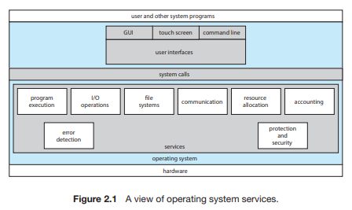
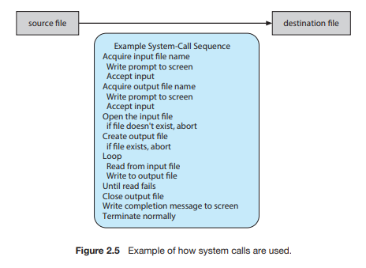
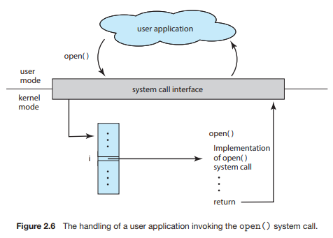

# Chapter02 Operating System Structures

# 운영체제 구조

## 2.1 운영체제 서비스

> 운영체제는 프로그램과 프로그램 사용자에게 특정 서비스를 제공한다. 
> 저마다 다른 서비스를 제공하지만 공통된 부류가 있다. 
> 다음의 서비스들은 프로그래머가 프로그래밍 작업을 더 쉽게 수행할 수 있도록 한다.

- 사용자 인터페이스
- 프로그램 수행
- 입출력 연산
- 파일 시스템 조작
- 통신
- 오류 탐지
- 자원 할당
- 기록 작성
- 보호와 보안

## 2.2 사용자와 운영체제 인터페이스

### 2.2.1 명령 인터프리터

> 운영체제 대부분은 명령 인터프리터를 프로세스가 시작되거나 사용자가 처음 로그온할 때 수행되는 특수한 프로그램으로 취급한다. 
> 선택할 수 있는 여러 명령 인터프리터를 제공하는 시스템엥서 이ㅏ 해석기는 **셸(shell)**이라 한다. 
> 명령 인터프리터의 중요한 기능은 사용자가 지정한 명령을 수행하는 것이다. 

#### 명령어의 두 가지 일반적인 구현 방식

1. 명령 인터프리터 자체가 명령을 실행할 코드를 갖는 경우
> 제공될 수 있는 명령의 수가 명령 인터프리터의 크기를 결정한다.

2. 시스템 프로그램에 의해 대부분의 명령을 구현하는 것
> 명령 인터프리터는 그 명령을 알지 못한다. 
> 단지 메모리에 적재되어 실행될 파일을 식별하기 위해 명령을 사용한다.

### 2.2.2 그래픽 기반 사용자 인터페이스

### 2.2.3 터치스크린 인터페이스

### 2.2.4 인터페이스의 선택

> 어떤 인터페이스를 선택할 지는 개인의 선호에 달려 있다. 

## 2.3 시스템 콜

> **시스템 콜**은 운영체제에 의해 사용 가능하게 된 서비스에 대한 인터페이스를 제공한다. 

### 2.3.1 시스템 콜 예제

> 다음은 시스템 콜이 사용되는 방법의 예이다.

### 2.3.2 응용 프로그래밍 인터페이스

> 대부분의 응용 개발자들은 **응용 프로그래밍 인터페이스(application programming interface, API)**에 따라 프로그램을 설계한다. 
> 예를 들어, Windows 함수 CreateProcess()는 새로운 프로세스를 생성하는 데 사용된다.

-  프로그램의 호환성 :
>   같은 API를 지원하는 어느 시스템에서건 컴파일되고 실행되도록 기대하기 때문이다. 
>   게다가 실제 시스템 콜은 종종 좀 더 자세한 명세가 필요하고 프로그램상에서 작업하기가 응용 프로그래머에게 가용한 API보다 더 어렵다. 

- 실행시간 환경(RTE) :
>   운영체제가 제공하는 시스템 콜에 대한 연결고리 역할을 하는 시스템 콜 인터페이스를 제공한다. 
>   시스템 콜 인터페이스는 API 함수의 호출을 가로채어 필요한 운영체제 시스템 콜을 부른다. 
>   운영체제 인터페잇흐에 대한 대부분의 자세한 내용은 API에 의해 프로그래머로부터 숨겨지고 RTE에 의해 관리된다. 

#### 운영체제에 매개변수를 전달하기 위한 세 가지 일반적인 방법

1. 매개변수를 레지스터 내에 전달하는 방법
2. 매개벼니수를 메모리 내 블록이나 테이블에 저장하고, 블록의 주소가 레지스터 내에 매개변수로 전달되는 방법
3. 매개변수가 5개가 넘을 경우 블록 방법

> 일부 운영체제에서 블록이나 스택방법을 선호하는데, 이유는 전달되는 매개변수들의 개수나 길이에 제한이 없기 때문이다.

### 2.3.3 시스템 콜의 유형

- 프로세스 제어
  - 끝내기, 중지
  - 적재, 수행
  - 프로세스 생성, 종료
  - 프로세스 속성 획득, 설정
  - 시간을 기다림
  - 이벤트를 기다림 및 알림
  - 메모리 할당 및 자유화
- 파일 조작
  - 파일 생성, 삭제
  - 열기, 닫기
  - 읽기, 쓰기, 위치 변경
  - 파일 속성 획득 및 설정
- 장치 관리
  - 장치 요구, 방출
  - 읽기, 쓰기, 위치 변경
  - 장치 속성 획득, 설정
  - 장치의 논리적 부착 또는 분리
- 정보 유지 보수
  - 시간과 날짜의 설정과 획득
  - 시스템 데이터의 설정과 획득
  - 프로세스, 파일, 장치 속성의 획득 및 설정
- 통신
  - 통신 연결의 생성, 제거
  - 메시지의 송신, 수신
  - 상태 정보 전달
  - 원격 장치의 부착 및 분리
- 보호
  - get file permissions
  - set file permissions

#### 2.3.3.1 프로세스 제어

>

