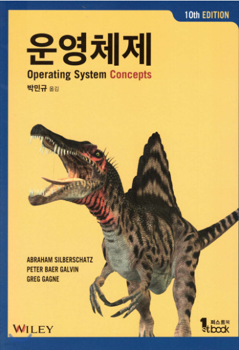

# 운영체제

---

> 'Operating System Concepts'  
> Abraham Silberschatz, Peter Baer Galvin, Greg Gagne 지음

---

# 목차

## Part 1
### Chapter 1 서론
#### 1.1 운영체제가 할 일
#### 1.2 컴퓨터ㅏ 시스템의 구성
#### 1.3 컴퓨터 시스템 구조
#### 1.4 운영체제의 작동
#### 1.5 자원관리
#### 1.6 보안과 보호
#### 1.7 가상화
#### 1.8 분산 시스템
#### 1.9 커널 자료 구조
#### 1.10 계산 환경
#### 1.11 무료 및 공개ㅑ 소스 운영체제
#### 1.12 요약

---

### Chapter 2 운영체제 구조
#### 2.1 운영체제 서비스
#### 2.2 사용자와 운영체제 인터페이스
#### 2.3 시스템 콜
#### 2.4 시스템 서비스
#### 2.5 링커와 로더
#### 2.6 응용 프로그램이 운영체제마다 다른 이유
#### 2.7 운영체제 설계 및 구현
#### 2.8 운영체제 구조
#### 2.9 운영체제 빌딩과 부팅
#### 2.10 운영체제 디버깅
#### 2.11 요약

---

## Part 2 프로세스 관리
### Chapter 3 프로세스
#### 3.1 프로세스 개념
#### 3.2 프로세스 스케줄링
#### 3.3 프로세스에 대한 연산
#### 3.4 프로세스 간 통신
#### 3.5 공유 메모리 시스템에서의 프로세스 간 통신
#### 3.6 메시지 전달 시스템에서의 프로세스 간 통신
#### 3.7 IPC 시스템의 사례
#### 3.8 클라이언틔 서버 환경에서 통신
#### 3.9 요약

---

### Chapter 4 스레드와 병행성
#### 4.1 개요
#### 4.2 다중 코어 프로그래밍
#### 4.3 다중 스레드 모델
#### 4.4 스레드 라이브러리
#### 4.5 암묵적 스레딩
#### 4.6 스레드와 관련된 문제들
#### 4.7 운영체제 사례
#### 4.8 요 약

---

### Chapter 5 CPU 스케줄링
#### 5.1 기본 개념
#### 5.2 스케줄링 기준
#### 5.3 스케줄링 알고리즘
#### 5.4 스레드 스케줄링
#### 5.5 다중 처리기 스케줄링
#### 5.6 실시간 CPU 스케줄링
#### 5.7 운영체제 사례들
#### 5.8 알고리즘의 평가
#### 5.9 요약

---

## Part 3 프로세스 동기화
### Chapter 6 동기화 도구들
#### 6.1 배경
#### 6.2 임계구역 문제
#### 6.3 Peterson의 해결안
#### 6.4 동기화를 위한 하드웨어 지원
#### 6.5 Mutex Locks
#### 6.6 세마포
#### 6.7 모니터
#### 6.8 라이브니스
#### 6.9 평가
#### 6.10 요약

---

### Chapter 7 동기화 예제
#### 7.1 고전적인 동기화 문제들
#### 7.2 커널 안에서의 동기화
#### 7.3 POSIX 동기화
#### 7.4 Java에서의 동기화
#### 7.5 대체 방안들
#### 7.6 요약

---

### Chapter 8 교착 상태
#### 8.1 시스템 모델
#### 8.2 다중 스레드 응용에서의 교착 상태
#### 8.3 교착 상태ㅑ 특성
#### 8.4 교착 상태 처리 방법
#### 8.5 교착 상태 예방
#### 8.6 교착 상태 회치
#### 8.7 교착 상태 탐지
#### 8.8 교착 상태로부터 회복
#### 8.9 요약

---

## Part 4 메모리 관리
### Chapter 9 메인 메모리
#### 9.1 배경
#### 9.2 연속 메모리 할당
#### 9.3 페이징
#### 9.4 페이지 테이블의 구조
#### 9.5 스와핑
#### 9.6 사례: Intel 32비트와 64비트 구조
#### 9.7 사례: ARM 구조
#### 9.8 요약

---

### Chapter 10 가상 메모리
#### 10.1 배경
#### 10.2 요구 페이징
#### 10.3 쓰기 시 복사
#### 10.4 페이지 교체
#### 10.5 프레임의 할당
#### 10.6 스래싱
#### 10.7 메모리 압축
#### 10.8 커널 메모리의 할당
#### 10.9 기타 고려 사항
#### 10.10 운영체제의 예
#### 10.11 요약

---

## Part 5 저장장치 관리
### Chapter 11 대용량 저장장치
#### 11.1 대용량 저장장치ㅏ 구조의 개관
#### 11.2 디스크 싀ㅏ케줄링
#### 11.3 NVM 스케줄링
#### 11.4 오류 감지 및 수정
#### 11.5 저장장치 관리
#### 11.6 스왑 공간 관리
#### 11.7 저장장치 연결
#### 11.8 RAID 구조
#### 11.9 요약

---

### Chapter 12 입출력 시스템
#### 12.1 개관
#### 12.2 입출력 하드웨어
#### 12.3 응용 입출력 인터페이스
#### 12.4 커널 입출력 서브시스템
#### 12.5 입출력 요구를 하드웨어 연산으로 변환
#### 12.6 STREAMS
#### 12.7 성능
#### 12.8 요약

---

## Part 6 파일 시스템
### Chapter 13 파일 시스템 인터페이스
#### 13.1 파일 개념
#### 13.2 접근 방법
#### 13.3 디렉터리 구조
#### 13.4 보호
#### 13.5 메모리 사상 파일
#### 13.6 요약

---

### Chapter 14 파일 시스템 구현
#### 14.1 파일 시스템 구조
#### 14.2 파일 시스템 구현
#### 14.3 디렉터리 구현
#### 14.4 할당 방법
#### 14.5 가용 공간의 관리
#### 14.6 효율과 성능
#### 14.7 복구
#### 14.8 예: WAFL 파일 시스템
#### 14.9 요약

---

### Chapter 15 파일 시스템 내부구조
#### 15.1 파일 시스템
#### 15.2 파일 시스템 마운팅
#### 15.3 파티션과 마운팅
#### 15.4 파일 공유
#### 15.5 가상 파일 시스템
#### 15.6 원격 파일 시스템
#### 15.7 일관성의 의미
#### 15.8 NFS
#### 15.9 요약

---

## Part 7 보안과 보호
### Chapter 16 보안
#### 16.1 보안 문제
#### 16.2 프로그램 위협
#### 16.3 시스템과 네트워크 위협
#### 16.4 보안 도구로서 암호 기법
#### 16.5 사용자 인증
#### 16.6 보안 방어의 구현
#### 16.7 예: Windows 10
#### 16.8 요약

---

### Chapter 17 보호
#### 17.1 보호의 목표
#### 17.2 보호의 원칙
#### 17.3 보호 링
#### 17.4 보호의 영역
#### 17.5 접근 행렬
#### 17.6 접근 행렬의 구현
#### 17.7 접근 권한의 취소
#### 17.8 역할 기반의 액세스 제어
#### 17.9 강제적 접근 제어
#### 17.10 자격-기반 시스템
#### 17.11 기타 보호 개선 방법
#### 17.12 언어 기반의 보호
#### 17.13 요약

---

## Part 8 진보된 주제
### Chapter 18 가상 머신
#### 18.1 개요
#### 18.2 역사
#### 18.3 장점 및 특징
#### 18.4 빌딩 블록
#### 18.5 VM 유형 및 구현
#### 18.6 가상화와 운영체제 구성요소
#### 18.7 사례
#### 18.8 가상화 연구
#### 18.9 요약

---

### Chapter 19 네트워크 및 분산 시스템
#### 19.1 분산 시ㅏ스템의 장점
#### 19.2 네트워크 구조
#### 19.3 통신 구조
#### 19.4 네트워크 및 분산 운영체제
#### 19.5 분산 시스템의 설계 문제
#### 19.6 분산 파일 시스템
#### 19.7 DFS 명명 및 투명성
#### 19.8 원격 파일 액세스
#### 19.9 분산 파일 시스템에 대한 최종 생각
#### 19.10 요약

---

## Part 9 사례 검토
### Chapter 20 Linux 시스템
#### 20.1 Linux 역사
#### 20.2 설계 원칙
#### 20.3 커널 모듈
#### 20.4 프로세스 관리
#### 20.5 스케줄링
#### 20.6 메모리 관리
#### 20.7 파일 시스템
#### 20.8 입/출력
#### 20.9 프로세스 간 통신
#### 20.10 네트워크 구조
#### 20.11 보안
#### 20.12 요약

---

### Chapter 21 Windows 10
#### 21.1 역ㄷ사
#### 21.2 설계 원칙
#### 21.3 시스템 구성요소
#### 21.4 터미널 서비스와 빠른 사용자 교체
#### 21.5 파일 시스템
#### 21.6 네트워킹
#### 21.7 프로그래머 인터페이스
#### 21.8 요약

---

## Part 10 부록
### Appendix A 영향력있는 운영체제

