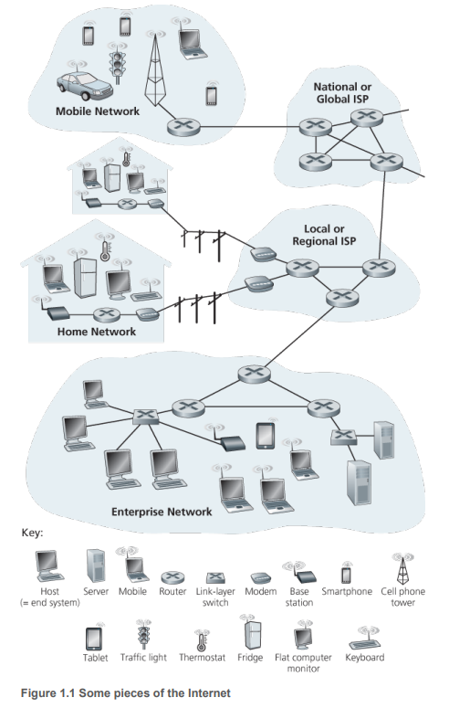

# Chapter 1 컴퓨터 네트워크와 인터넷

- 이 책의 목적 :
> 컴퓨터 네트워킹의 역동적 분야에 대한 현대적 개요를 제공 
> 현재의 네트워크뿐만 아니라 미래의 네트워크를 이해하는 데 필요한 원리와 실용적인 통찰력 제공

- Chapter 1 의 목적 :
> 컴퓨터 네트워킹과 인터넷 개요 
> 뒤에 나오는 내용에 대한 문맥 또는 개념을 설정 

## 1.1 인터넷이란 무엇인가?

> 두 가지 관점이 있다.

### 1.1.1 구성요소로 본 인터넷

> 인터넷은 전 세계적으로 수십억 개의 컴퓨팅 장치를 연결하는 컴퓨터 네트워크이다. 

> 