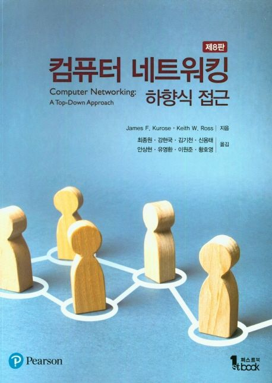

# 컴퓨터 네트워킹 - 하향식 접근

---

> 'Computer Networking: A Top-Down Approach'  
> James F. Kurose, Keith W. Ross 지음

---

# 목차

## Chapter 1 컴퓨터와 네트워크 인터넷
### 1.1 인터넷이란 무엇인가?
### 1.2 네트워크의 가장자리
### 1.3 네트워크 코어
### 1.4 패킷 교환 네트워크에서의 지연, 손실과 처리율
### 1.5 프로토콜 계층과 서비스 모델
### 1.6 공격받는 네트워크
### 1.7 컴퓨터 네트워킹과 인터넷의 역사
### 1.8 요약

---

## Chapter 2 애플리케이션 계층
### 2.1 네트워크 애플리케이션의 원리
### 2.2 웹과 HTTP
### 2.3 인터넷 전자메일
### 2.4 DNS: 인터넷의 디렉터리 서비스
### 2.5 P2P 파일 분배
### 2.6 비디오 스트리밍과 콘텐츠 분배 네트워크
### 2.7 소켓 프로그래밍: 네트워크 애플리케이션 생성
### 2.8 요약

---

## Chapter 3 트랜스포트 계층
### 3.1 트랜스포트 계층 서비스 및 개요 
### 3.2 다중화와 역다중화
### 3.3 비연결형 트랜스포트: UDP
### 3.4 신뢰적인 데이터 전송의 원리
### 3.5 연결지향형 트랜스포트: TCP
### 3.6 혼잡 제어의 원리
### 3.7 TCP 혼잡 제어
### 3.8 트랜스포트 계층 기능의 발전
### 3.9 요약

---

## Chapter 4 네트워크 계층: 데이터 평면
### 4.1 네트워크 계층 개요
### 4.2 라우터 내부에는 무엇이 있을까?
### 4.3 인터넷 프로토콜(IP): IPv4, 주소체계, IPv6 emd
### 4.4 일반화된 포워딩 및 소프트웨어 기반 네트워크(SDN)
### 4.5 미들박스
### 4.6 요약

---

## Chapter 5 네트워크 계층: 제어 평면
### 5.1 개요
### 5.2 라우팅 알고리즘
### 5.3 인터넷에서의 AS 내부 라우팅: OSPF
### 5.4 인터넷 서비스 제공업자(ISP) 간의 라우팅: BGP
### 5.5 소프트웨어 정의 네트워크(SDN) 제어 평면
### 5.6 인터넷 제어 메시지 프로토콜(ICMP)
### 5.7 네트워크 관리와 SNMP, NETCONF/YANG
### 5.8 요약

---

## Chapter 6 링크 계층과 근거리 네트워크
### 6.1 링크 계층 소개
### 6.2 오류 검출 및 정정 기술
### 6.3 다중 접속 링크와 프로토콜
### 6.4 스위치 근거리 네트워크
### 6.5 링크 가상화: 링크 계층으로서의 네트워크
### 6.6 데이터 센터 네트워킹
### 6.7 총정리: 웹페이지 요청에 대한 처리
### 6.8 요약

---

## Chapoter 7 무선 및 이동 네트워크
### 7.1 개요
### 7.2 무선 링크와 네트워크의 특징
### 7.3 와이파이: 802.11 무선 랜
### 7.4 셀룰러 네트워크: 4G, 5G
### 7.5 이동성 관리: 원칙
### 7.6 실전에서의 이동성 관리
### 7.7 무선과 이동성: 상위 계층 프로토콜에의 영향
### 7.8 요약

---

## Chapter 8 컴퓨터 네트워크 보안
### 8.1 네트워크 보안이란 무엇인가?
### 8.2 암호의 원리
### 8.3 메시지 무결성과 전자서명
### 8.4 종단점 인증
### 8.5 전자메일의 보안
### 8.6 TCP 연결의 보안: TLS
### 8.7 네트워크 계층 보안: IPsec과 가상 사설 네트워크
### 8.8 무선 랜과 4G/5G 셀룰러 네트워크 보안
### 8.9 운영 보안: 방화벽과 침입 탐지 시스템
### 8.10 요약

---
